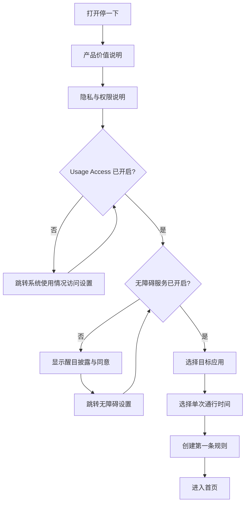
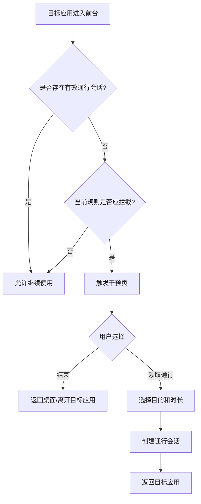
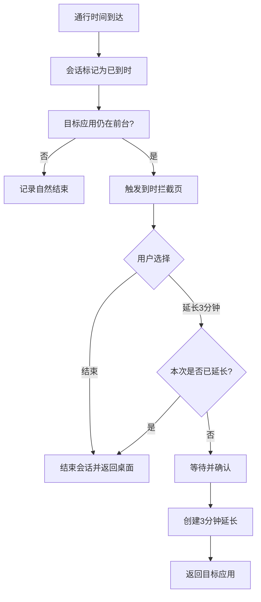
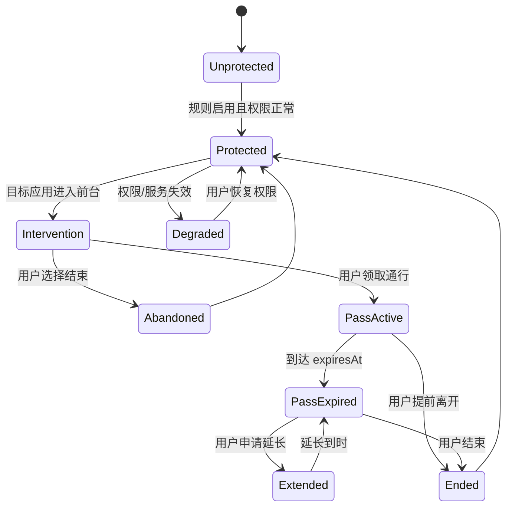

# 停一下（PauseNow）产品需求文档（PRD）

> 文档版本：v0.1  
> 文档状态：技术验证版  
> 更新日期：2026-07-16  
> 首发平台：Android  
> 产品形态：Flutter + Kotlin 混合应用  
> 负责人/架构角色：项目负责人、产品负责人、技术架构师  
> 本阶段目标：验证“短视频打开干预 + 限时通行 + 到时拦截”的技术闭环与用户价值

---

## 1. 文档目的

本文档用于统一“停一下”项目在 Android 技术验证阶段的产品目标、功能范围、业务规则、验收标准和非功能要求。

本阶段不以“立即上架完整产品”为目标，而以回答以下三个问题为目标：

1. Android 是否能够稳定识别用户打开目标短视频应用；
2. 用户是否能理解并完成权限配置、规则创建和干预流程；
3. 干预是否能真实减少用户无意识打开和连续刷短视频的时间。

---

## 2. 产品概述

### 2.1 产品名称

- 中文名：停一下
- 英文名：PauseNow
- 项目代码名：`pause_now`
- 建议 Android Application ID：`com.<公司域名>.pausenow`
- 宣传语：刷之前，先停一下。

### 2.2 一句话定位

帮助用户在打开短视频前恢复一次主动选择，并在达到预设时间后及时退出。

### 2.3 产品不是什​​么

“停一下”不是：

- 家长远程监控工具；
- 手机内容审查工具；
- 聊天内容或视频内容识别工具；
- 强制锁死设备的企业管理工具；
- 心理治疗或医疗诊断工具；
- 普通的番茄钟；
- 单纯依赖每日总限额的应用锁。

### 2.4 核心产品假设

用户无法减少短视频时间，往往不是因为不知道自己刷得太久，而是因为：

1. 打开行为高度自动化；
2. 打开前没有明确目的；
3. 一旦进入信息流，时间感知降低；
4. 系统限额太容易被忽略、延期或关闭；
5. 事后统计距离行为发生太远，无法形成即时反馈。

因此，产品不只做“锁”，而是构建三个连续干预点：

- 打开前：让无意识行为变成一次明确选择；
- 使用中：根据用户承诺的时间执行限时；
- 到时后：增加继续刷的决策成本，并给予即时反馈。

---

## 3. 项目目标

### 3.1 技术验证目标

完成以下闭环：

```text
用户授权
  → 选择一个目标应用
  → 设置单次允许使用 5 分钟
  → 打开目标应用
  → 出现“停一下”干预页
  → 用户选择打开目的并领取 5 分钟通行
  → 允许进入目标应用
  → 5 分钟结束
  → 再次出现拦截页
  → 用户结束或申请延长 3 分钟
  → 生成本地使用记录
```

### 3.2 用户价值验证目标

验证用户是否认为以下价值足以持续使用：

- 减少无意识打开次数；
- 减少单次连续使用时长；
- 改善工作、学习和睡前场景；
- 比系统自带“屏幕使用时间”更容易坚持。

### 3.3 商业验证目标

技术验证版暂不接入支付。内测阶段记录：

- 愿意付费人数；
- 可接受价格；
- 更愿意购买年费还是买断；
- 用户愿意为什么高级功能付费。

---

## 4. 目标用户

### 4.1 首批核心用户

18～35 岁、有主动自律需求的学生、程序员和职场人，满足至少两项：

- 每天使用短视频或内容流应用超过 2 小时；
- 工作或学习时会下意识打开短视频；
- 睡前经常超时使用手机；
- 使用过系统限额但主动忽略；
- 曾经卸载或关闭过其他自律应用；
- 明确希望减少使用时间，但多次失败。

### 4.2 典型用户画像

#### 用户 A：远程工作程序员

- 工作中频繁切换到抖音或小红书；
- 每次只想看几分钟，实际经常超过半小时；
- 不希望完全封锁，只希望在打开前被提醒。

#### 用户 B：备考学生

- 学习时需要保留手机查资料；
- 不适合把手机完全关机；
- 希望限制短视频应用，但不限制微信和浏览器。

#### 用户 C：睡前失控用户

- 上床后习惯打开短视频；
- 最初计划使用 10 分钟，实际使用 1 小时；
- 希望在 23:00 后提高打开和延长的成本。

---

## 5. 使用场景

### 5.1 工作专注

工作日 09:00—12:00、14:00—18:00，打开目标应用时先干预；用户可选择“处理明确事项”并领取短时通行。

### 5.2 学习专注

用户启动 30～90 分钟学习规则，期间禁止或严格限制短视频应用。

### 5.3 睡前止刷

每天固定时间后进入严格模式，默认不允许打开；如确需使用，需要等待并说明原因。

### 5.4 普通日常限时

不设完全禁止时段，只限制每次打开的使用时间，降低连续沉浸。

---

## 6. MVP 范围

### 6.1 P0：技术验证必须完成

| 编号 | 功能 | 说明 |
|---|---|---|
| FR-001 | 首次引导 | 解释产品目标、权限用途和隐私边界 |
| FR-002 | 使用情况访问授权 | 引导用户开启 Usage Access |
| FR-003 | 无障碍服务授权 | 醒目披露后，引导开启 AccessibilityService |
| FR-004 | 权限状态检测 | 返回应用后自动检测是否已授权 |
| FR-005 | 目标应用选择 | 从可管理应用列表中选择至少一个目标应用 |
| FR-006 | 单次通行时间 | 支持 5、10、15 分钟，技术验证默认 5 分钟 |
| FR-007 | 打开前干预 | 识别目标应用进入前台并触发干预页 |
| FR-008 | 打开目的选择 | 用户选择本次打开原因 |
| FR-009 | 通行会话 | 放行目标应用并记录会话开始 |
| FR-010 | 到时拦截 | 通行时间结束后再次触发干预页 |
| FR-011 | 延长一次 | 支持延长 3 分钟，并记录延长行为 |
| FR-012 | 结束使用 | 将用户带离目标应用或引导返回桌面 |
| FR-013 | 今日统计 | 展示打开、放行、放弃、超时和使用分钟数 |
| FR-014 | 本地规则保存 | 应用重启后保留规则 |
| FR-015 | 服务状态提示 | 权限或服务失效时立即提示 |

### 6.2 P1：内测增强

- 固定时间段规则；
- 每日总限额；
- 多个目标应用；
- 睡前模板；
- 工作日模板；
- 每周报告；
- 更长的延长等待；
- 开机后规则恢复；
- 电池优化兼容引导；
- 内测反馈入口。

### 6.3 P2：商业化候选

- 年度订阅或买断；
- 严格模式；
- 可信联系人；
- 多设备同步；
- 30 天减少短视频计划；
- 个性化干预强度；
- 桌面小组件；
- Android 与 iOS 数据同步。

---

## 7. 明确不做的范围

技术验证阶段不做：

- 精准识别微信视频号页面；
- 读取视频、聊天、输入框、支付或账号内容；
- 识别用户正在观看的视频主题；
- 自动操作第三方应用中的按钮；
- 防卸载、防关机或绕过系统安全机制；
- 远程控制另一台手机；
- 家长端与孩子端；
- VPN 流量分析；
- 悬浮广告；
- 社交社区；
- AI 心理咨询；
- 云端账号体系；
- 服务端大数据分析；
- 同时开发 iOS。

---

## 8. 核心业务流程

### 8.1 首次使用流程



### 8.2 打开前干预流程



### 8.3 到时干预流程



---

## 9. 干预页需求

### 9.1 打开前文案

标题：

> 停一下，你准备做什么？

选项：

- 搜一个明确内容；
- 回复或处理一件事；
- 放松 5 分钟；
- 没有明确目的。

操作：

- 结束，不打开；
- 领取通行时间。

### 9.2 到时文案

标题：

> 你原计划使用 5 分钟，现在已经到了。

信息：

- 本次计划时间；
- 本次实际时间；
- 今日已使用时间；
- 今日成功停止次数。

操作：

- 结束使用；
- 延长 3 分钟。

### 9.3 交互原则

- 不羞辱用户；
- 不使用“失败、没救、自制力差”等表达；
- 不制造焦虑；
- 不夸大“治疗成瘾”；
- 操作简单，一屏完成；
- 默认推荐结束使用，而不是延长；
- 延长按钮可见，但需要额外确认。

---

## 10. 规则模型

### 10.1 Rule

| 字段 | 类型 | 说明 |
|---|---|---|
| id | String | 规则 ID |
| name | String | 规则名称 |
| enabled | Boolean | 是否启用 |
| targetPackages | List<String> | 用户选择的目标应用包 |
| mode | Enum | `session_limit`、`schedule_block`、`daily_limit` |
| sessionMinutes | Int | 单次允许分钟数 |
| extensionMinutes | Int | 延长分钟数 |
| maxExtensions | Int | 单次最大延长次数 |
| schedule | Schedule? | 可选时间段 |
| dailyLimitMinutes | Int? | 可选每日总限额 |
| createdAt | DateTime | 创建时间 |
| updatedAt | DateTime | 更新时间 |

### 10.2 ActivePass

| 字段 | 类型 | 说明 |
|---|---|---|
| id | String | 通行会话 ID |
| packageName | String | 目标应用 |
| purpose | Enum/String | 打开目的 |
| startedAt | DateTime | 开始时间 |
| expiresAt | DateTime | 到期时间 |
| extensionCount | Int | 已延长次数 |
| status | Enum | active、expired、ended、cancelled |

### 10.3 InterventionEvent

| 字段 | 类型 | 说明 |
|---|---|---|
| id | String | 事件 ID |
| packageName | String | 目标应用 |
| eventType | Enum | detected、blocked、granted、extended、abandoned、ended |
| occurredAt | DateTime | 发生时间 |
| ruleId | String? | 关联规则 |
| passId | String? | 关联通行 |
| metadata | Map | 本地扩展信息 |

---

## 11. 状态机



关键约束：

- 同一目标应用同时只能存在一个有效通行；
- 通行只对当前包名有效；
- 应用切到后台时记录，但不立即销毁通行；
- 锁屏期间不应累计“前台实际使用时长”；
- 延长次数达到上限后只能结束；
- 系统时间变化必须触发会话重新校验。

---

## 12. 权限需求

### 12.1 使用情况访问权限

用途：

- 获取目标应用前后台使用事件；
- 汇总使用时间；
- 校验 AccessibilityService 事件；
- 生成本地统计。

要求：

- 明确说明用途；
- 用户主动跳转系统设置开启；
- 未授权时不伪造统计；
- 不上传安装列表和使用记录。

### 12.2 无障碍服务

用途限定为：

- 识别用户主动选择的目标应用进入前台；
- 执行用户预先定义的确定性拦截规则；
- 打开“停一下”的干预界面；
- 在用户选择结束后返回桌面或离开目标应用。

禁止：

- 读取或记录页面文本；
- 读取输入内容；
- 自动点击第三方应用；
- 修改系统设置；
- 在用户不知情时执行自主操作；
- 使用无障碍数据做广告画像。

### 12.3 通知权限

用于：

- 服务状态；
- 权限失效提醒；
- 今日或每周报告；
- 必要的前台服务通知（若后续技术验证证明需要）。

---

## 13. 本地数据与隐私

### 13.1 默认原则

- 本地优先；
- 最小收集；
- 无账号可用；
- 不接广告 SDK；
- 不上传用户安装应用列表；
- 不上传使用记录；
- 不采集第三方应用内容；
- 用户可一键清除全部本地数据。

### 13.2 技术验证版数据

允许本地保存：

- 用户主动选择的目标应用标识；
- 用户创建的规则；
- 通行会话；
- 干预事件；
- 汇总后的每日统计；
- 权限与服务状态。

### 13.3 隐私披露

首次申请无障碍服务前，必须在应用内部展示独立披露页面，至少说明：

1. 使用的系统能力；
2. 为什么使用；
3. 会检测什么；
4. 明确不会读取什么；
5. 数据是否上传；
6. 用户如何关闭权限；
7. 用户同意后才跳转系统设置。

---

## 14. 今日统计

技术验证版首页只展示：

- 今日目标应用实际使用分钟数；
- 今日检测到的打开次数；
- 今日成功放弃打开次数；
- 今日发放通行次数；
- 今日延长次数；
- 当前保护状态。

不展示未经验证的“节省了多少生命”等夸张指标。

### 14.1 指标定义

| 指标 | 定义 |
|---|---|
| 打开次数 | 目标应用从非前台状态进入前台的有效次数，需去抖 |
| 干预次数 | 满足规则并实际展示干预页的次数 |
| 放弃次数 | 干预页出现后，用户选择结束且未进入通行 |
| 通行次数 | 创建 ActivePass 的次数 |
| 延长次数 | 到时后用户实际创建延长会话的次数 |
| 实际使用时长 | 目标应用处于前台且屏幕处于交互状态的估算时长 |
| 自然结束 | 通行到期前用户主动离开目标应用 |

---

## 15. 非功能要求

### 15.1 性能

- 目标应用进入前台到干预页出现：P95 ≤ 1.5 秒；
- 首页冷启动：P95 ≤ 2.5 秒；
- 日常事件写入不得阻塞 UI；
- 单日事件数据量可控，定期聚合和清理。

### 15.2 稳定性

- 连续打开目标应用 50 次不崩溃；
- 手机锁屏、解锁后状态正确；
- 应用进程被杀后，服务恢复时规则可重新加载；
- 系统重启后可检测服务状态并提醒用户；
- 修改时区或系统时间后，不应产生无限通行；
- 权限失效时进入降级状态，不声称仍在保护。

### 15.3 电量

- 不进行高频常驻轮询；
- AccessibilityService 以事件驱动为主；
- UsageStats 用于校验与统计，不以亚秒级轮询实现拦截；
- 技术验证需记录 8 小时后台电量影响。

### 15.4 兼容性

首轮真机至少覆盖：

- Android 13；
- Android 14；
- Android 15；
- Android 16（条件允许时）；
- 至少三个不同厂商系统。

建议优先覆盖：

- 小米/Redmi；
- OPPO/一加；
- vivo/iQOO；
- 华为/荣耀（按可获得设备选择）；
- Pixel 或接近原生 Android 的设备。

---

## 16. 验收标准

### 16.1 权限闭环

- [ ] 首次进入可清晰理解两项核心权限用途；
- [ ] 用户可从应用跳转到正确系统设置；
- [ ] 返回后权限状态自动刷新；
- [ ] 未授权时不允许创建“已生效”规则；
- [ ] 无障碍服务关闭后首页 5 秒内显示异常状态。

### 16.2 应用识别与拦截

- [ ] 用户能选择至少一个目标应用；
- [ ] 打开目标应用后 1.5 秒内出现干预页；
- [ ] 同一前台事件不会重复弹出多个干预页；
- [ ] 获得通行后不会立即再次拦截；
- [ ] 通行到期后目标应用仍在前台时可再次拦截；
- [ ] 选择结束后可离开目标应用。

### 16.3 计时

- [ ] 5 分钟通行误差不超过 5 秒；
- [ ] 锁屏时间不计入实际使用时长；
- [ ] 离开目标应用后统计停止；
- [ ] 返回目标应用时能根据通行剩余时间继续；
- [ ] 修改系统时间后会话被重新校验。

### 16.4 数据

- [ ] 重启“停一下”后规则仍存在；
- [ ] 今日统计与原始事件可追溯；
- [ ] 用户可清空全部数据；
- [ ] 技术验证版不向服务器上传使用数据。

---

## 17. 内测指标与决策门槛

建议首轮 20 名真实用户，连续使用 7 天。

| 指标 | 继续开发门槛 |
|---|---:|
| 权限配置完成率 | ≥ 70% |
| 创建第一条规则比例 | ≥ 65% |
| 目标应用识别成功率 | ≥ 95% |
| 拦截触发 P95 | ≤ 1.5 秒 |
| D1 留存 | ≥ 50% |
| D7 留存 | ≥ 25% |
| 7 日内至少使用 4 天 | ≥ 30% |
| 用户自报“有帮助” | ≥ 60% |
| 明确愿意付费 | ≥ 15% |
| 严重误拦截投诉 | ≤ 5% |

### 17.1 Go 条件

同时满足：

- 技术成功率达标；
- 至少 3 名用户愿意真实付费；
- 无严重隐私或权限问题；
- 电量和兼容性可接受。

### 17.2 Pivot 条件

- 用户愿意使用但不愿授权无障碍；
- 用户更关注睡前模式而不是全天控制；
- 用户只需要固定时段，不需要单次通行；
- 拦截稳定，但干预页过于打扰。

### 17.3 Stop 条件

- 主流设备上识别/拦截成功率长期低于 90%；
- 后台耗电不可接受；
- 权限配置完成率低于 40%；
- 真实用户普遍认为系统自带功能足够；
- 应用市场政策无法接受当前核心能力。

---

## 18. 风险与待验证问题

| 风险 | 影响 | 验证方式 |
|---|---|---|
| 厂商后台限制导致服务失效 | 高 | 多厂商 8 小时、24 小时测试 |
| 无障碍政策审核 | 高 | 从首版按醒目披露和最小用途设计 |
| 目标应用切换事件抖动 | 中 | 建立去抖和状态机 |
| 全屏干预页被系统限制 | 高 | 技术 Spike 验证不同 Android 版本 |
| 用户关闭权限 | 高 | 状态检测与恢复引导 |
| 用户反感频繁拦截 | 中 | 通行会话、冷却时间和模板化规则 |
| 统计与系统数字不完全一致 | 中 | 明确“估算”，UsageStats 校验 |
| 微信视频号无法稳定单独控制 | 高 | 明确不进入 MVP |
| 规则可被轻易绕过 | 中 | 定位为自我管理，不承诺绝对防绕过 |

---

## 19. 版本规划

### v0.0.1 技术 Spike

- 权限检测；
- 监听一个目标包；
- 打开干预 Activity；
- 5 分钟通行；
- 到时二次拦截；
- 本地日志。

### v0.1.0 内部 Alpha

- Flutter 完整引导；
- 应用选择；
- 规则配置；
- 今日统计；
- 权限失效提示；
- 三厂商测试。

### v0.2.0 封闭 Beta

- 固定时间段；
- 多应用；
- 反馈入口；
- 崩溃日志（不包含敏感使用数据）；
- 签名 APK；
- 20 名用户测试。

### v0.3.0 商业验证

- 价格页但不一定接支付；
- 年费/买断意愿测试；
- 每周报告；
- 睡前模板；
- 上架合规材料准备。

---

## 20. 官方参考

- Flutter Android 环境配置：<https://docs.flutter.dev/platform-integration/android/setup>
- Flutter 版本信息：<https://docs.flutter.dev/release/whats-new>
- Android UsageStatsManager：<https://developer.android.com/reference/android/app/usage/UsageStatsManager>
- Android AccessibilityService：<https://developer.android.com/guide/topics/ui/accessibility/service>
- Android 前台服务：<https://developer.android.com/develop/background-work/services/fgs>
- Android 包可见性：<https://developer.android.com/training/package-visibility>
- Google Play Accessibility API 政策：<https://support.google.com/googleplay/android-developer/answer/10964491>
- Google Play 目标 API 要求：<https://developer.android.com/google/play/requirements/target-sdk>

---

## 21. 变更记录

| 版本 | 日期 | 变更 |
|---|---|---|
| v0.1 | 2026-07-16 | 创建 Android 技术验证版 PRD |
