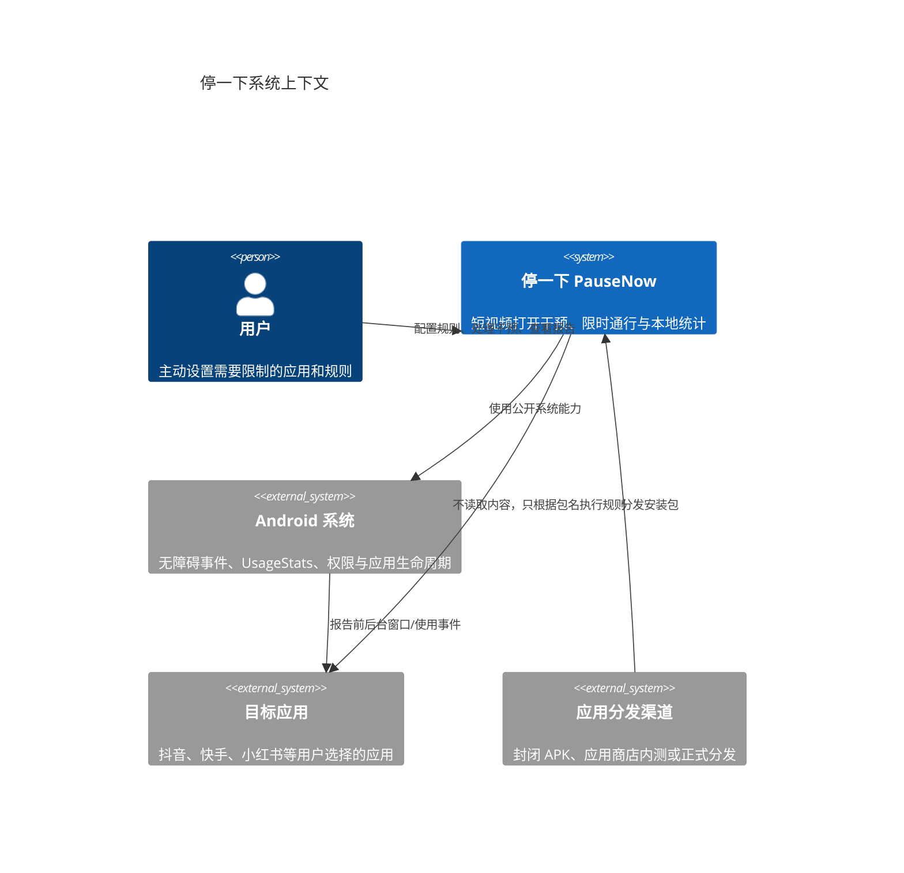
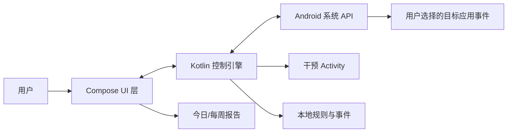
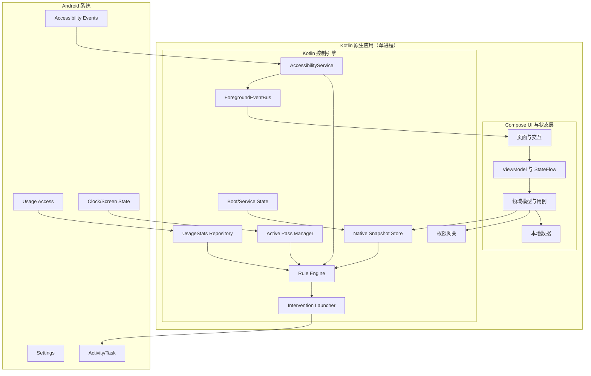
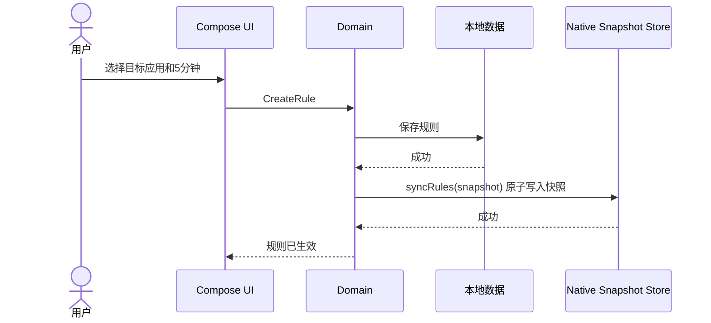
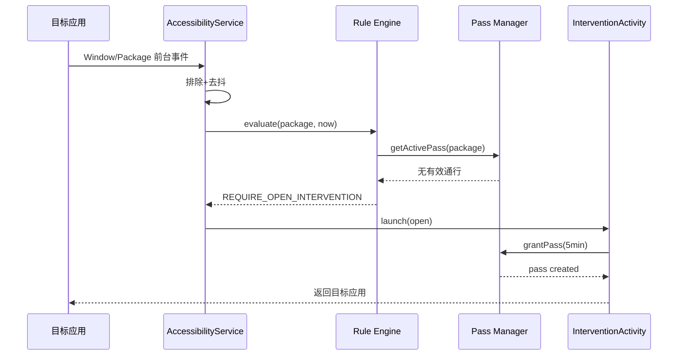
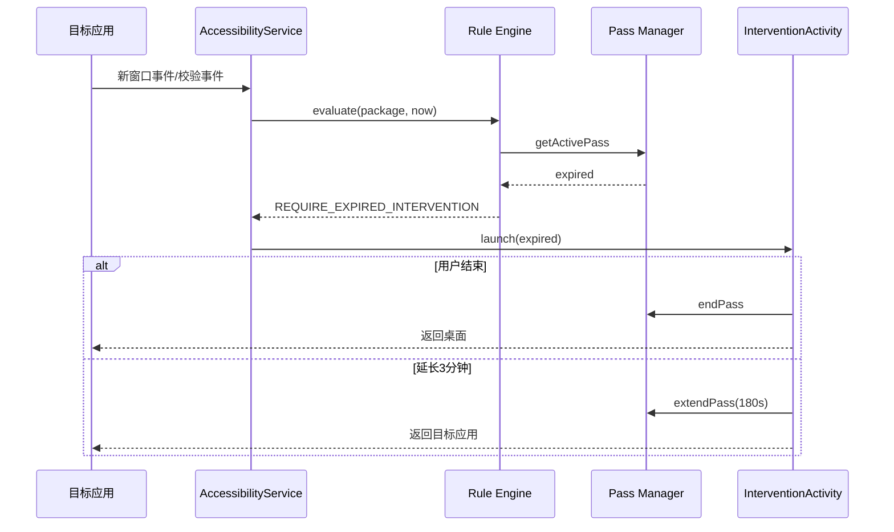

# 停一下（PauseNow）系统架构与项目推进方案

> 文档版本：v0.2  
> 更新日期：2026-07-17  
> 阶段：Android 技术验证至封闭 Beta  
> 架构：Kotlin 原生（Jetpack Compose UI + Kotlin 控制引擎，单进程）  
> 目标：以最小成本验证核心技术、用户留存和付费意愿

---

## 1. 架构决策摘要

### 1.1 已确定决策

| 决策 | 结果 |
|---|---|
| 首发平台 | Android |
| 开发环境 | Windows 11 |
| UI/产品层 | Kotlin + Jetpack Compose |
| Android 核心能力 | Kotlin |
| 原生检测 | AccessibilityService 事件驱动 |
| 使用统计 | UsageStatsManager |
| 进程内通信 | 单进程原生，无 Flutter、无跨进程桥接 |
| 数据策略 | 本地优先，无账号、无服务端 |
| 干预页 | Spike 先原生 Activity |
| 第一目标 | 独立短视频/内容流应用 |
| 微信视频号 | 不进入 MVP |
| 支付 | 技术验证阶段不接入 |
| 上架策略 | 先签名 APK 封闭测试，再准备应用商店合规 |

### 1.2 核心原则

1. **先证明系统能力，再开发完整产品。**
2. **检测与规则引擎不依赖 UI 进程前台；无障碍服务可在 Activity 不可见时继续工作。**
3. **无障碍服务只执行用户明确配置的确定性规则。**
4. **不读取第三方页面内容。**
5. **不以高频轮询换取实时性。**
6. **规则、通行和事件均可持久化恢复。**
7. **每个阶段必须有明确的 Go/Pivot/Stop 门槛。**
8. **不为未来可能的功能提前建设服务器。**

---

## 2. 系统上下文



若 Markdown 渲染器不支持 C4 Mermaid，可使用下面的简化图：



---

## 3. 总体架构



---

## 4. 分层职责

### 4.1 Compose UI 与 Presentation

负责：

- Onboarding；
- 权限说明和状态；
- 应用选择；
- 规则编辑；
- 首页保护状态；
- 今日报告；
- 本地隐私设置；
- 内测反馈。

要求：

- 状态经 `ViewModel` + `StateFlow` 持有，UI 单向消费；
- 不在 Composable 中实现规则判断；
- 不依赖 `Handler`/`Timer` 作为核心拦截计时（计时由通行管理器驱动）。

### 4.2 Kotlin Domain

核心实体：

- ManagedApp；
- ProtectionRule；
- ActivePass；
- InterventionEvent；
- DailySummary；
- PermissionSnapshot。

核心用例：

- CreateFirstRule；
- UpdateRule；
- EnableProtection；
- GrantPass；
- ExtendPass；
- EndSession；
- GetTodaySummary；
- ClearAllData。

### 4.3 本地数据

负责：

- 规则主数据；
- 聚合事件；
- 用户偏好；
- 数据迁移；
- 本地导出/清除。

### 4.4 进程内访问（无桥接）

纯 Kotlin 单进程方案下，UI/Domain 直接调用原生网关与存储，不再需要 MethodChannel/Pigeon。阶段 1 已落地：

- 权限状态读取：`AndroidPermissionGateway`；
- 打开系统设置：`AndroidPermissionGateway.openUsageAccessSettings / openAccessibilitySettings`；
- 接收前台事件：`ForegroundEventBus`（单进程 observer 注册表）；
- 本地事件存储：`ForegroundEventStore`（SharedPreferences，最近 50 条）。

要求：

- 不直接向 UI 暴露 Android Framework 可变对象；
- 所有时间统一使用 UTC 毫秒或明确的本地时区语义；
- 大数据量不通过频繁跨层调用；事件用推送，状态用快照。

> 历史：原方案在 Spike 用 MethodChannel、Alpha 用 Pigeon，现已统一为单进程原生，移除跨进程桥接。

### 4.5 Kotlin Permission Gateway

负责：

- Usage Access 状态；
- AccessibilityService 状态；
- 通知权限；
- 打开对应系统设置；
- 厂商特殊设置入口（仅在确实需要时提供）。

### 4.6 Kotlin Detection

由两部分组成：

1. AccessibilityService：实时事件；
2. UsageStatsManager：统计和校验。

规则：

- Accessibility 为实时主信号；
- UsageStats 不做亚秒级轮询；
- 事件需去抖；
- 维护最近前台包状态；
- 排除系统 UI、自身应用、桌面、输入法和干预 Activity。

### 4.7 Kotlin Rule Engine

输入：

```text
packageName
eventType
eventTimestamp
screenInteractive
currentRules
activePass
permissionState
serviceState
```

输出：

```text
ALLOW
REQUIRE_OPEN_INTERVENTION
REQUIRE_EXPIRED_INTERVENTION
END_AND_GO_HOME
DEGRADED
IGNORE
```

Rule Engine 必须是纯逻辑或尽量接近纯逻辑，方便单元测试。

### 4.8 Active Pass Manager

负责：

- 创建通行；
- 判断有效期；
- 延长；
- 结束；
- 跨进程持久化；
- 开机/时间变化校验；
- 避免重复通行。

### 4.9 Intervention Launcher

负责：

- 防重复启动；
- 生成一次性干预上下文；
- 启动 InterventionActivity；
- 处理用户结果；
- 返回桌面或目标应用；
- 记录结果。

### 4.10 Native Snapshot Store

UI/Domain 同步到控制引擎的最小快照：

```json
{
  "schemaVersion": 1,
  "updatedAt": 0,
  "rules": [],
  "protectedPackages": [],
  "settings": {
    "interventionCooldownMs": 1000,
    "defaultExtensionSeconds": 180
  }
}
```

AccessibilityService 只读取快照，不直接访问 UI 侧复杂数据库。

---

## 5. 核心数据流

### 5.1 规则创建



### 5.2 打开目标应用



### 5.3 通行到期



说明：仅依赖“5 分钟后系统主动弹页”可能受后台启动限制影响。技术 Spike 必须验证到时触发机制。可组合：

- 目标应用后续窗口事件；
- 合规的 Alarm/Work 机制；
- 必要且符合政策的前台通知/服务；
- 当用户下一次交互或重新进入时立即拦截。

产品不能承诺在所有厂商、所有系统状态下做到毫秒级到时弹出。

---

## 6. 规则引擎设计

### 6.1 优先级

从高到低：

1. 权限/服务失效 → `DEGRADED`；
2. 自身应用、系统排除包 → `IGNORE`；
3. 非目标应用 → `ALLOW`；
4. 有有效通行 → `ALLOW`；
5. 通行已到期 → `REQUIRE_EXPIRED_INTERVENTION`；
6. 处于严格禁止时间 → `REQUIRE_OPEN_INTERVENTION`；
7. 达到每日总限额 → `REQUIRE_OPEN_INTERVENTION`；
8. 单次通行模式 → `REQUIRE_OPEN_INTERVENTION`；
9. 默认 → `ALLOW`。

### 6.2 伪代码

```kotlin
fun evaluate(input: EvaluationInput): Decision {
    if (!input.permissionsReady) return Decision.Degraded
    if (input.packageName in input.excludedPackages) return Decision.Ignore

    val rule = input.rules
        .filter { it.enabled }
        .filter { input.packageName in it.targetPackages }
        .maxByOrNull { it.priority }
        ?: return Decision.Allow

    val pass = input.activePass

    if (pass != null && pass.isValid(input.now, input.bootSessionId)) {
        return Decision.Allow
    }

    if (pass != null && pass.isExpired(input.now)) {
        return Decision.RequireExpiredIntervention(rule.id)
    }

    if (rule.schedule?.contains(input.localDateTime) == true) {
        return Decision.RequireOpenIntervention(rule.id, Reason.Schedule)
    }

    if (rule.dailyLimitReached(input.dailyUsageSeconds)) {
        return Decision.RequireOpenIntervention(rule.id, Reason.DailyLimit)
    }

    return Decision.RequireOpenIntervention(rule.id, Reason.SessionPassRequired)
}
```

---

## 7. 并发与一致性

### 7.1 潜在并发

- UI 线程正在修改规则，AccessibilityService 事件线程同时读取；
- 多个无障碍事件同时到达；
- 干预 Activity 重复启动；
- 通行到期与用户主动结束同时发生；
- Activity 与 AccessibilityService 生命周期不一致（同一进程，但服务可独立存活）。

### 7.2 策略

- 规则快照原子替换；
- Rule Engine 单线程串行消费事件；
- 以 `packageName + interventionType` 建立短期互斥；
- ActivePass 更新使用 compare-and-set 或 Mutex；
- 事件写入幂等；
- 每个 InterventionContext 具有唯一 token；
- Activity 结果只消费一次。

---

## 8. 错误模型

建议统一错误码：

| 错误码 | 含义 |
|---|---|
| PN-PERM-001 | Usage Access 未授权 |
| PN-PERM-002 | AccessibilityService 未开启 |
| PN-PERM-003 | 通知权限未开启 |
| PN-BRIDGE-001 | 进程内状态同步失败（规则快照写入/读取） |
| PN-RULE-001 | 规则快照解析失败 |
| PN-PASS-001 | 通行状态损坏 |
| PN-INT-001 | 干预 Activity 启动失败 |
| PN-USAGE-001 | UsageStats 查询失败 |
| PN-STORE-001 | 本地存储失败 |
| PN-CLOCK-001 | 检测到时间异常 |
| PN-SERVICE-001 | 服务状态异常 |

用户界面不直接展示技术码，但反馈页应允许复制诊断信息。

---

## 9. 日志与可观测性

### 9.1 本地日志

允许：

- 服务启动/停止；
- 权限状态变化；
- 规则版本；
- 包名哈希或测试环境中的包名；
- 决策结果；
- 干预启动耗时；
- 错误码。

禁止：

- 页面文本；
- 输入内容；
- 视频标题；
- 聊天信息；
- 账号信息；
- 完整安装列表上传；
- 支付界面信息。

### 9.2 技术验证统计

本地记录：

```text
detectedAt
interventionStartedAt
renderedAt
decision
packageName
ruleId
passId
appVersion
androidVersion
deviceManufacturer
```

公开内测前，可将敏感包名替换为本地映射 ID。

### 9.3 崩溃收集

技术 Spike 不接第三方崩溃 SDK。

封闭 Beta 若接入 Crashlytics/Sentry：

- 关闭自动收集敏感上下文；
- 不上传目标应用列表；
- 不上传使用事件详情；
- 隐私政策明确披露；
- 提供开关。

---

## 10. 安全与隐私架构

### 10.1 威胁

- 第三方获取用户安装应用；
- 日志泄露使用习惯；
- 无障碍能力被滥用；
- 规则文件被篡改；
- 干预 Activity 被外部恶意调用；
- 用户误以为产品能读取内容。

### 10.2 控制

- 所有非必要组件 `exported=false`；
- AccessibilityService 只绑定系统权限；
- 不开启窗口内容读取；
- 原生快照校验 schema；
- 不接受外部 Intent 中的任意包名作为信任输入；
- 干预上下文使用一次性 token；
- Release 关闭调试日志；
- 本地数据按 Android 沙箱保存；
- 后续敏感偏好可使用 EncryptedSharedPreferences/Keystore；
- 清晰权限披露。

---

## 11. 性能架构

### 11.1 目标

| 指标 | 目标 |
|---|---:|
| Accessibility 事件处理 | P95 < 50 ms |
| Rule Engine 决策 | P95 < 10 ms |
| 干预页可见 | P95 < 1.5 s |
| 规则快照读取 | < 20 ms |
| 首页冷启动 | P95 < 2.5 s |
| 8 小时后台额外耗电 | 初测目标 < 3% |

### 11.2 优化原则

- 不在 Accessibility 回调中做数据库复杂查询；
- 规则快照保存在内存并可快速恢复；
- 图标解析和应用列表查询不在事件路径；
- 事件异步落盘；
- 干预页资源轻量；
- 避免在主线程做重活；
- UsageStats 查询批量执行。

---

## 12. 测试架构

### 12.1 单元测试

重点：

- 规则优先级；
- 通行有效/过期；
- 延长次数；
- 时间段跨午夜；
- 时间异常；
- 去抖；
- 每日统计聚合。

### 12.2 原生仪器测试

- 权限状态；
- 快照写入读取；
- InterventionActivity；
- BootReceiver 状态；
- 包可见性；
- 屏幕状态。

### 12.3 Compose UI 测试

- Onboarding；
- 权限状态卡；
- 规则创建；
- 今日报告；
- 错误恢复。

### 12.4 集成测试

核心 E2E：

```text
安装 → 授权 → 选择目标应用 → 设5分钟
→ 打开目标应用 → 干预 → 放行
→ 到时 → 干预 → 结束 → 查看统计
```

由于跨应用操作自动化受限，E2E 采用“自动测试 + 真机人工脚本”组合。

### 12.5 回归设备表

| 设备 | Android | 厂商 | 角色 |
|---|---:|---|---|
| Device A | 13+ | 用户主力机 | 每日开发 |
| Device B | 14/15 | 不同厂商 | 兼容性 |
| Device C | 16 | Pixel/新设备 | 目标 API 行为 |
| Device D | 国产深度定制 | 小米/OPPO/vivo/华为 | 后台与权限 |

---

## 13. 代码仓库与协作

### 13.1 分支

```text
main            可演示、可构建
develop         阶段集成
feature/*       功能
spike/*         技术实验
fix/*           缺陷修复
release/*       封闭测试版本
```

小团队也可采用 trunk-based：

- `main` 始终可构建；
- 小功能短分支；
- Pull Request 合并；
- Feature Flag 隔离未完成能力。

推荐小团队采用后者，减少分支管理成本。

### 13.2 Commit

建议：

```text
feat(android): detect selected foreground package
feat(intervention): add five-minute pass
fix(rules): prevent duplicate intervention
docs(prd): clarify accessibility disclosure
test(engine): cover pass expiration
```

### 13.3 Definition of Done

每项功能必须：

- 有验收标准；
- 通过静态检查；
- 核心逻辑有测试；
- 真机验证；
- 不新增不必要权限；
- 更新文档；
- 可在 Debug APK 演示；
- 不破坏既有闭环。

---

## 14. CI 方案

### 14.1 技术验证阶段

本地脚本：

```powershell
cd android
.\gradlew.bat testDebugUnitTest
.\gradlew.bat lintDebug
.\gradlew.bat assembleDebug
```

### 14.2 Alpha 后

GitHub Actions 或其他 CI：

1. checkout；
2. setup Java 17；
3. setup Android SDK 36；
4. format check（ktlint / detekt，按需）；
5. `gradlew testDebugUnitTest`；
6. `gradlew lintDebug`；
7. `gradlew assembleDebug`；
8. 上传构建产物。

Release 签名密钥仅放 CI Secret，不进仓库。

---

## 15. 推进阶段

## 阶段 0：项目初始化

### 目标

环境、仓库、文档和最小 Kotlin 原生应用可运行。

### 任务

- 安装 Android Studio/JDK 17；
- 初始化 Git；
- 创建 Kotlin 原生（Compose）项目；
- 确定 Application ID；
- 加入 lint、测试和 docs；
- 默认应用真机运行；
- 建立三份基础文档。

### 退出标准

- `gradlew --version` 与 SDK 配置通过；
- 真机运行；
- Debug APK 构建成功；
- main 分支可复现。

---

## 阶段 1：权限与事件 Spike

### 目标

证明 Android 能获取所需权限和目标应用前台包事件。

### 任务

- Usage Access 状态和跳转；
- Accessibility 醒目披露；
- AccessibilityService；
- 只监听需要的事件；
- 输出包名日志；
- 自身包和系统包排除；
- 去抖。

### 退出标准

- 3 台设备上均可授权；
- 打开目标应用能稳定识别；
- 识别成功率 ≥ 95%；
- 无页面内容读取；
- 无明显后台耗电。

### Stop 条件

- 主力设备无法稳定接收包事件；
- 权限流程在大多数目标用户设备上不可完成。

---

## 阶段 2：干预与通行 Spike

### 目标

完成最小技术闭环。

### 任务

- 原生 InterventionActivity；
- 打开前干预；
- 5 分钟通行；
- 到时状态；
- 延长 3 分钟；
- 返回桌面；
- 原生持久化；
- 防重复弹出。

### 退出标准

- 完整闭环可连续演示 20 次；
- 干预页 P95 ≤ 1.5 秒；
- 无无限循环；
- 5 分钟误差 ≤ 5 秒；
- 锁屏/切后台基本正确。

### Pivot 条件

如果“到时自动弹出”受系统限制不稳定：

- 改为到时显示高优先级通知；
- 用户下一次窗口交互时立即拦截；
- 保留“重新进入立即拦截”；
- 不使用违规后台启动手段。

---

## 阶段 3：Alpha 产品化

### 目标

把技术 Demo 变成可由普通用户完成配置的 Alpha。

### 任务

- Onboarding；
- 权限中心；
- 应用列表；
- 规则编辑；
- 规则与应用偏好本地持久化；
- 今日报告；
- 数据清除；
- 状态诊断。

### 退出标准

- 新用户 3 分钟内完成配置；
- 无需开发者手动改包名；
- App 重启后规则保留；
- 权限关闭后正确降级；
- 可生成签名 Alpha APK。

---

## 阶段 4：多设备封闭测试

### 目标

验证稳定性、价值和留存。

### 任务

- 20 名用户；
- 7 天测试；
- 设备信息和错误码收集；
- 每日反馈；
- 统计授权、拦截、留存；
- 访谈高频用户和流失用户。

### 退出标准

参考 PRD：

- 权限完成率 ≥ 70%；
- 技术成功率 ≥ 95%；
- D7 ≥ 25%；
- 有帮助 ≥ 60%；
- 至少 3 人愿意付费。

---

## 阶段 5：Beta 产品化

### 目标

形成可尝试分发的产品版本。

### 任务

- 时间段规则；
- 睡前模板；
- 每周报告；
- 正式隐私政策；
- 无障碍用途披露；
- 应用内反馈；
- 崩溃收集最小化；
- 签名与版本管理；
- 应用商店材料；
- 国内分发渠道评估。

### 退出标准

- 关键崩溃率可接受；
- 多厂商 24 小时稳定；
- 权限披露完成；
- 无明显政策红线；
- 商业模式和价格有初步证据。

---

## 阶段 6：商业验证

### 目标

验证用户是否真实付款。

### 候选方案

- 年费 48～68 元；
- 早期买断 68～98 元；
- 免费 1 个应用，高级版多应用/严格模式；
- 7 天高级功能试用。

原则：

- 不在用户价值未验证前建设复杂订阅后台；
- 数字功能上架商店后按渠道支付政策执行；
- 价格测试必须以真实支付，而不是口头意愿为准。

---

## 16. 建议两周技术验证任务板

### Day 1

- Android 原生环境；
- 创建仓库和项目；
- 真机运行；
- 确定 Application ID。

### Day 2

- 权限中心 UI；
- Usage Access 跳转和检测；
- Accessibility 披露页。

### Day 3

- AccessibilityService；
- 包事件日志；
- 目标包识别；
- 排除与去抖。

### Day 4

- InterventionActivity；
- 从目标应用拉起；
- 返回桌面；
- 防循环。

### Day 5

- ActivePass；
- 5 分钟通行；
- 原生持久化；
- 到期判断。

### Day 6

- 延长 3 分钟；
- 结束流程；
- 原始事件日志；
- 计时测试。

### Day 7

- 应用列表（Compose）；
- 规则保存；
- 规则快照同步；
- 本地持久化。

### Day 8

- 首页（Compose）；
- 权限和保护状态；
- 今日统计。

### Day 9

- 锁屏、切后台、重启；
- 系统时间变化；
- 连续打开回归。

### Day 10

- 第二台设备适配；
- 厂商后台设置记录；
- 电量测试。

### Day 11

- 第三台设备适配；
- 修复重复拦截；
- 性能日志。

### Day 12

- 签名 APK；
- 5 名种子用户；
- 首次配置观察。

### Day 13

- 修复权限流程；
- 改进文案；
- 故障诊断页。

### Day 14

- v0.1 Alpha；
- 技术报告；
- Go/Pivot/Stop 评审；
- 决定是否扩展至 20 人测试。

该计划是推进基线；若核心 Spike 在前 5 天无法闭环，应优先解决或停止扩展 UI。

---

## 17. Backlog

### P0

- [ ] 环境初始化；
- [x] 权限中心（阶段 1）；
- [x] AccessibilityService（阶段 1）；
- [ ] UsageStats；
- [ ] 目标应用选择；
- [ ] Rule Snapshot；
- [ ] 打开前干预；
- [ ] 5 分钟通行；
- [ ] 到时干预；
- [ ] 延长 3 分钟；
- [ ] 今日统计；
- [x] 本地事件清除（阶段 1）；
- [ ] 三设备回归。

### P1

- [ ] 固定时间段；
- [ ] 每日总限额；
- [ ] 睡前模板；
- [ ] 多规则优先级；
- [ ] 周报；
- [ ] 权限失效通知；
- [ ] Boot 状态检查；
- [ ] 反馈与诊断；
- [ ] 崩溃收集最小化。

### P2

- [ ] 严格模式；
- [ ] 可信联系人；
- [ ] 订阅；
- [ ] 云同步；
- [ ] iOS；
- [ ] 30 天计划；
- [ ] 桌面组件。

---

## 18. 风险登记表

| ID | 风险 | 概率 | 影响 | 应对 |
|---|---|---:|---:|---|
| R01 | 无障碍审核不通过 | 中 | 高 | 最小用途、醒目披露、视频演示、无内容读取 |
| R02 | 厂商后台杀服务 | 高 | 高 | 多厂商测试、状态检测、必要时用户引导 |
| R03 | 到时无法立即弹页 | 中 | 高 | 事件触发+通知+下次交互拦截，避免违规后台启动 |
| R04 | 用户不愿开启权限 | 中 | 高 | 先解释价值、分步授权、3分钟内完成 |
| R05 | 用户觉得干预烦 | 中 | 中 | 通行、冷却、场景模板、可调强度 |
| R06 | 使用时间统计偏差 | 高 | 中 | 交叉校验、声明估算、关注趋势 |
| R07 | 目标应用改包或多版本 | 中 | 中 | 用户选择，不依赖单一硬编码目录 |
| R08 | 微信视频号需求无法满足 | 高 | 中 | 产品明确聚焦独立应用 |
| R09 | 过度架构延迟验证 | 中 | 高 | Spike 先原生闭环，后逐步分层 |
| R10 | 隐私争议 | 低/中 | 高 | 本地优先、无内容读取、无广告 SDK |

---

## 19. 关键架构决策记录（ADR）

### ADR-001：Android 优先

原因：

- Windows 11 可完成全部 Android 开发；
- Android 对技术 Spike 更直接；
- 无需 macOS/Xcode；
- 可先通过 APK 验证真实用户。

### ADR-002：UI 层技术选型（2026-07-17 修订）

> 原方案 Flutter + Kotlin 已废弃，修订为纯 Kotlin 原生。

当前决策：Kotlin + Jetpack Compose，单进程，无跨进程桥接。

原因：

- 单进程原生，事件经 `ForegroundEventBus` 直达 UI，无 MethodChannel/Pigeon；
- Kotlin 直接接入系统 API，Compose 满足产品 UI 开发速度；
- 原生控制引擎不依赖外部 UI 进程存活；
- 阶段 1 仅需 Android，移除 Flutter 降低工具链与体积成本。

废弃原因：Flutter Engine 不必引入；纯原生已能满足 UI 开发速度，且省去跨进程桥接与额外运行时。

### ADR-003：Accessibility 主检测，UsageStats 辅助

原因：

- UsageStats 适合统计，不适合亚秒实时拦截；
- Accessibility 事件可及时获得前台包变化；
- 组合可提高可用性并降低轮询耗电。

### ADR-004：原生干预 Activity 先行

原因：

- UI 进程不一定前台；
- 原生 Activity 启动更快；
- Spike 先确认系统能力；
- 稳定后再统一视觉。

### ADR-005：本地优先

原因：

- 降低成本；
- 降低隐私风险；
- MVP 不需要账号；
- 更容易解释权限。

### ADR-006：不申请 QUERY_ALL_PACKAGES

原因：

- 安装应用清单属于敏感数据；
- Google Play 对广泛包可见性有限制；
- MVP 只需可启动应用和用户主动选择。

---

## 20. 项目管理节奏

### 每日

- 今天完成什么；
- 遇到的系统限制；
- 真机验证结果；
- 新增权限或依赖；
- 次日最关键的一个风险。

### 每周

输出一页评审：

1. 核心闭环是否可演示；
2. 成功率和耗时；
3. 新增/关闭风险；
4. 用户反馈；
5. 是否满足阶段退出标准；
6. 下周只做哪三个高优先级事项。

### 缺陷优先级

| 等级 | 定义 |
|---|---|
| P0 | 无法授权、无法识别、无限弹窗、数据/隐私严重问题 |
| P1 | 计时错误、重启失效、主流设备无法使用 |
| P2 | UI 错位、统计小偏差、非主路径问题 |
| P3 | 体验优化、文案、视觉细节 |

---

## 21. 最终 Go / Pivot / Stop 评审

### Go

- 识别和拦截成功率 ≥ 95%；
- 核心设备稳定；
- 权限完成率 ≥ 70%；
- D7 ≥ 25%；
- 至少 3 人真实愿意付款；
- 政策材料可准备。

### Pivot

- 技术可行，但用户不喜欢“每次打开都干预”；
- 改为睡前、工作时段或连续使用到时干预；
- 用户最关心的不是总时长，而是打开次数；
- 由“应用锁”转为“场景化通行证”。

### Stop

- 核心设备长期无法稳定执行；
- 权限流程导致绝大多数用户放弃；
- 应用商店政策无法接受核心实现；
- 实际用户认为没有比系统自带能力更高的价值；
- 维护成本明显超过可接受商业价值。

---

## 22. 交付物清单

### 文档

- [x] 产品需求文档；
- [x] 开发环境与技术验证设计；
- [x] 系统架构与推进方案；
- [ ] 隐私政策；
- [x] 无障碍醒目披露文案；
- [x] 阶段 1 测试用例；
- [ ] 应用商店审核说明；
- [x] 阶段 1 技术 Spike 验证与待验报告。

### 代码

- [x] Kotlin 原生（Compose）项目；
- [x] Kotlin AccessibilityService；
- [ ] UsageStats Repository；
- [ ] Rule Engine；
- [ ] ActivePass；
- [ ] InterventionActivity；
- [x] ForegroundEventBus（阶段 1，单进程）；
- [x] 阶段 1 本地事件记录；
- [x] 阶段 1 自动化测试；
- [ ] 签名 Alpha APK。

---

## 23. 官方参考

- Jetpack Compose：<https://developer.android.com/jetpack/compose>
- Android 应用构建：<https://developer.android.com/build>
- Kotlin Android 开发：<https://developer.android.com/kotlin>
- Android AccessibilityService：<https://developer.android.com/guide/topics/ui/accessibility/service>
- Android UsageStatsManager：<https://developer.android.com/reference/android/app/usage/UsageStatsManager>
- Android 前台服务：<https://developer.android.com/develop/background-work/services/fgs>
- Android 包可见性：<https://developer.android.com/training/package-visibility>
- Google Play Accessibility API 政策：<https://support.google.com/googleplay/android-developer/answer/10964491>
- Google Play targetSdk：<https://developer.android.com/google/play/requirements/target-sdk>

---

## 24. 变更记录

| 版本 | 日期 | 变更 |
|---|---|---|
| v0.1 | 2026-07-16 | 创建 Flutter + Kotlin 总体架构、风险和阶段推进方案 |
| v0.2 | 2026-07-17 | 阶段 1 改为纯 Kotlin 原生（Compose），移除 Flutter/桥接，更新架构图、分层、阶段与 ADR |
