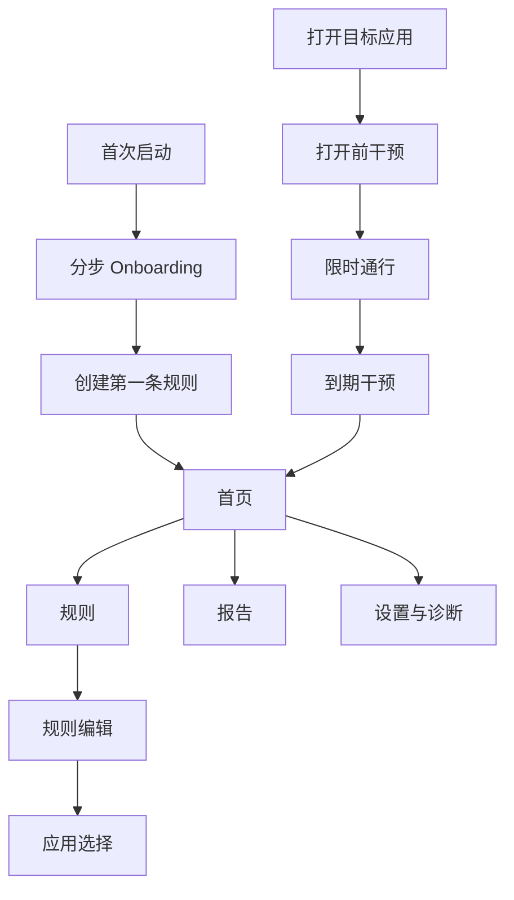
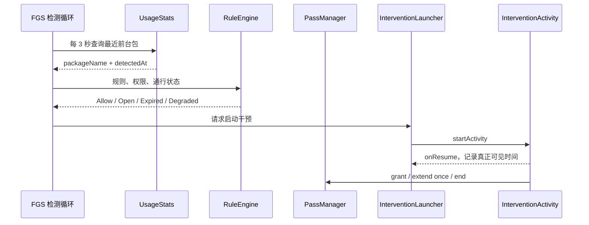

# 停一下（PauseNow）二期产品、技术与 UI 任务规划

> 文档版本：v1.0  
> 编制日期：2026-07-18  
> 规划阶段：Phase 2 / Stage 4  
> 目标版本：Android v0.2.0 封闭 Alpha  
> 技术栈：Kotlin + Jetpack Compose，单进程，本地优先  
> 建议周期：4 周开发 + 1 周封闭验证（单人主开发节奏）

---

## 1. 执行结论

一期已经证明核心技术路线可行：在 OPPO ColorOS 14 和华为 HarmonyOS 4.2 上，`FGS + UsageStats` 能支撑“识别目标应用 → 打开前干预 → 限时通行 → 到期干预 → 延长或结束”的完整闭环。

二期的核心不是继续证明“能不能弹出来”，而是把技术 Alpha 变成 **普通用户能正确配置、能理解状态、遇到权限或厂商限制能自行修复、可供 10～20 人连续使用 7 天** 的封闭测试产品。

二期只围绕四条主线推进：

1. **产品闭环**：补齐使用目的、一次延长限制、正确统计口径和异常恢复。
2. **UI 产品化**：重做 Onboarding、首页、规则、干预、报告和诊断体验。
3. **可靠性工程**：增加本地可观测性，完成小米/vivo、多轮触发、锁屏和 8 小时待机验证。
4. **可分发性**：正式签名、版本说明、隐私材料和封闭测试包。

二期明确不建设账号、服务端、支付、家长端、微信视频号识别、复杂规则系统和应用商店正式上架。先获得真实使用数据，再决定三期范围。

---

## 2. 已审阅资料与基线

本规划基于以下资料：

- `01_停一下_产品需求文档_PRD.md`
- `02_停一下_Kotlin原生_开发环境与技术验证设计.md`
- `03_停一下_系统架构与项目推进方案.md`
- `04_阶段1_权限与前台事件_Spike验证.md`
- `05_OPPO真机技术验证报告.md`
- `06_华为真机技术验证报告.md`
- `07_停一下_技术总结与下阶段规划.md`

### 2.1 一期已完成能力

| 领域 | 当前状态 | 二期处理 |
|---|---|---|
| Usage Access、无障碍、通知权限 | 已实现状态检测与跳转 | 重做分步引导、失效修复和状态解释 |
| 前台应用检测 | FGS 中每 3 秒查询 UsageStats，真机可用 | 增加延迟埋点、耗电与长时稳定性验证 |
| 干预闭环 | open / grant / expired / extend / end 已跑通 | 产品化视觉、使用目的、只允许延长一次 |
| 多规则 | 可新建、编辑、启停、删除 | 简化编辑流程，明确冲突和优先级策略 |
| 应用选择 | 仅查询 LAUNCHER 应用，支持搜索 | 增加图标、已选择状态和空状态 |
| 首页 | 可显示权限、规则和通行摘要 | 重构为“当前保护状态 + 快速修复 + 今日反馈” |
| 报告 | 今日事件计数和按应用分组 | 改为用户可理解的指标，增加 7 日轻量趋势 |
| 本地持久化 | SharedPreferences + Snapshot schema v2 | 保留运行快照，规范数据模型和迁移边界 |
| 真机验证 | OPPO、华为闭环通过 | 补小米、vivo；完成长时与回归矩阵 |
| 隐私 | 静态检查 8/8 | 保持全部不变量，不新增网络权限 |

### 2.2 必须先消除的不一致

| 编号 | 不一致 | 二期决策 |
|---|---|---|
| GAP-01 | PRD 顶部仍写 Flutter + Kotlin，实际为纯 Kotlin Compose | 更新 PRD 和架构文档，纯 Kotlin 为唯一基线 |
| GAP-02 | 架构文档仍称 Accessibility 为主信号 | 改为 FGS + UsageStats 主检测，无障碍仅作前台辅助 |
| GAP-03 | PRD 要求每次最多延长一次，代码可多次延长 | `extensionCount >= 1` 时禁止再次延长，UI 同步隐藏入口 |
| GAP-04 | 原目标 P95 干预延迟不高于 1.5 秒，但轮询间隔为 3 秒 | 二期门槛改为中位数不高于 2.2 秒、P95 不高于 4 秒 |
| GAP-05 | 华为特殊权限无法可靠程序化判定 | 展示“需要手动确认”，提供路径说明和“我已完成”确认，不伪造状态 |
| GAP-06 | “今日使用时间”容易被误解为真实前台时长 | 二期只展示可证明的“计划通行时长/通行次数/主动结束次数” |
| GAP-07 | Stage 1 验证文档仍有未完成项，但后续阶段已实际通过 | 将其标记为历史采证结论，不再作为当前项目状态页 |

---

## 3. 二期目标与成功门槛

### 3.1 产品目标

首批用户无需开发者协助，可以在 5 分钟内完成：

1. 理解产品与隐私边界；
2. 完成系统权限和厂商设置；
3. 选择一个短视频应用并建立规则；
4. 经历一次打开前干预和一次到期干预；
5. 在首页理解当前保护是否有效；
6. 权限失效时按指引自行修复。

### 3.2 封闭测试 Gate

| 维度 | 必须达到的门槛 |
|---|---|
| 首次配置 | 5 名非开发用户中至少 4 人在 5 分钟内完成首条规则 |
| 识别可靠性 | 每台验收设备 100 次目标应用打开，5 秒内正确干预率不低于 95% |
| 干预延迟 | 中位数不高于 2.2 秒；P95 不高于 4 秒；记录检测和 Activity 可见两个时间点 |
| 重复弹窗 | 同一次前台会话不得出现两个可见干预页 |
| 延长规则 | 同一通行会话最多延长一次，重启后仍保持限制 |
| 权限降级 | Usage Access 或无障碍失效时不误拦截，首页 10 秒内显示可操作修复提示 |
| 长时稳定性 | OPPO、华为、小米、vivo至少各完成一次 8 小时待机；核心进程状态和规则恢复符合厂商预期 |
| 耗电 | 同设备、同条件下，开启保护较关闭保护的 8 小时增量耗电不超过 2 个百分点；超出则必须评审 |
| 数据正确性 | 清除数据、跨重启恢复、日期跨零点、系统时间变化均有测试证据 |
| 质量 | 单元测试、lint、debug/release 构建和隐私静态检查全部通过；封测回归无 P0/P1 缺陷 |
| 隐私 | 无 INTERNET、QUERY_ALL_PACKAGES、SYSTEM_ALERT_WINDOW；不读取页面内容，不上传数据 |

> 注：3 秒轮询决定了 1.5 秒 P95 不具备工程可实现性。二期先测量真实分布；若 4 秒仍影响体验，再以事件驱动辅助优化，而不是盲目提高轮询频率。

---

## 4. 二期范围

### 4.1 P0：必须交付

- 统一设计语言和 Compose 组件库；
- 新版 Onboarding 与权限修复中心；
- 新版首页、规则列表、规则编辑、应用选择器；
- 打开前干预页和到期干预页产品化；
- 使用目的选择及事件记录；
- 单次通行只允许延长一次；
- 正确的今日报告和 7 日轻量趋势；
- 本地诊断信息、复制诊断、厂商手动确认；
- 检测延迟、启动结果、权限降级和通行操作的本地埋点；
- OPPO、华为、小米、vivo回归；
- 锁屏、重启、跨零点、8 小时待机和耗电测试；
- 正式 keystore、封闭测试 APK、隐私政策和内测说明。

### 4.2 P1：时间允许再做

- 睡前模板和工作专注模板；
- 深色模式；
- 规则拖动排序；
- 自定义打开前提示文案；
- 诊断信息通过系统分享面板导出；
- 7 日报告的应用筛选。

### 4.3 延后到三期

- 每日总限额、复杂时间段、工作日/节假日规则；
- 一条规则绑定多个应用；
- 云端账号、跨设备同步、服务端埋点；
- 订阅支付和会员权益；
- 家长端/孩子端；
- 微信内视频号识别；
- iOS 版本；
- 正式应用商店上架。

延后的原因是这些能力会显著扩大规则冲突、后台策略、数据模型或合规范围，不应混入可靠性尚未完成的封闭测试阶段。

---

## 5. 信息架构与导航

二期采用三主入口，避免首页继续堆功能按钮：



主导航：

- **首页**：保护状态、正在通行、今日结果和修复入口；
- **规则**：规则列表、新建和编辑；
- **报告**：今日与近 7 日行为反馈；
- **设置**：首页右上角进入，不占底部主导航。

干预页使用独立全屏 Activity，不显示底部导航，不允许返回目标应用绕过决策。

---

## 6. UI 设计方向

### 6.1 产品气质

关键词：**温和、克制、可信、清醒、有行动感**。

产品不使用“你又失败了”“自律差”等羞辱性文案，也不采用强烈警报式视觉。用户已经受到短视频刺激，PauseNow 的界面应降低刺激、帮助恢复主动选择。

### 6.2 视觉基线

| Token | 建议值 | 用途 |
|---|---|---|
| Primary | `#356C63` | 主按钮、开启状态、品牌色 |
| Primary Container | `#D7E8E2` | 状态卡和轻提示背景 |
| Background | `#F6F7F4` | 全局背景 |
| Surface | `#FFFFFF` | 卡片和弹层 |
| Text Primary | `#1E2623` | 标题和正文 |
| Text Secondary | `#66706C` | 辅助信息 |
| Warning | `#B97828` | 权限异常、即将到期 |
| Error | `#B5544B` | 不可用状态，不用于普通劝阻 |
| Radius | 16dp / 24dp | 卡片 / 主要干预容器 |
| Spacing | 4、8、12、16、24、32dp | 统一间距系统 |

字体使用 Android 系统中文字体，标题强调字重而不是超大字号；正文最小 14sp，主要按钮最小高度 52dp，触控区域不小于 48dp。

### 6.3 组件清单

- `PauseTopBar`
- `ProtectionHeroCard`
- `PermissionStatusRow`
- `ActivePassCard`
- `MetricCard`
- `RuleCard`
- `AppPickerRow`
- `PurposeChip`
- `DurationSelector`
- `VendorGuideCard`
- `PrimaryActionButton`
- `SecondaryActionButton`
- `EmptyState`
- `InlineError`
- `ConfirmSheet`

所有组件必须支持 loading、empty、normal、warning、disabled 和 error 状态中的适用子集，并提供 Compose Preview。

---

## 7. 页面与交互规格

### 7.1 Onboarding

建议拆为 5 步，不再把多个设置入口堆在一个页面：

| 步骤 | 核心内容 | 完成条件 |
|---|---|---|
| 1. 价值说明 | “不是封禁，而是在打开前帮你重新选择” | 点击继续 |
| 2. 隐私说明 | 只识别应用包名、不读内容、不联网；可查看详细说明 | 点击继续 |
| 3. 使用情况访问 | 解释用途、跳转系统设置、回前台刷新 | 系统状态已开启 |
| 4. 无障碍服务 | 醒目披露、勾选确认、跳转系统设置 | 服务状态已开启 |
| 5. 厂商适配与首条规则 | 华为/小米/vivo显示对应说明，然后选择应用和时长 | 规则保存成功 |

交互要求：

- 返回 App 后自动刷新权限状态；
- 用户拒绝时允许退出，不循环强迫授权；
- 华为的启动管理和后台弹出界面显示“请按步骤设置”，由用户点击“我已完成”确认；
- Onboarding 完成条件是必需系统权限就绪且至少存在一条启用规则；
- 后续权限失效不重进完整 Onboarding，而进入权限修复中心。

### 7.2 首页

首屏只回答三个问题：**现在是否在保护、正在保护什么、我今天做得怎么样**。

从上到下：

1. 顶部品牌名与设置入口；
2. 保护 Hero 卡：`保护中 / 需要修复 / 暂无规则`；
3. 异常时显示唯一主操作“去修复”；
4. 有通行时显示应用、剩余时间、计划目的和“立即结束”；
5. 今日反馈：干预次数、主动离开次数、已领取通行次数；
6. 启用规则摘要，最多显示 3 条；
7. 无规则时显示创建第一条规则的空状态。

状态优先级：权限异常 > 厂商设置未确认 > 无启用规则 > 正在通行 > 正常保护。

### 7.3 权限修复中心

权限状态不得只显示“红色失败”，必须给出可执行动作：

| 状态 | 文案 | 操作 |
|---|---|---|
| Usage Access 关闭 | 无法判断目标应用是否打开 | 打开使用情况访问设置 |
| 无障碍关闭 | 保护服务当前未运行 | 打开无障碍设置 |
| 通知关闭 | 到期时可能无法及时提醒 | 打开通知设置 |
| 华为启动管理未确认 | 系统可能在后台停止保护 | 查看设置步骤 / 我已完成 |
| 华为后台弹出未确认 | 干预页可能无法显示在目标应用上方 | 查看设置步骤 / 我已完成 |

每行在 `ON_RESUME` 刷新。厂商手动确认项与系统可检测项必须采用不同图标和文案。

### 7.4 规则列表与编辑

规则列表卡片显示：应用图标、应用名、单次通行时长、是否允许一次延长、启停开关。包名仅在诊断页展示。

规则编辑二期只保留用户能理解的字段：

- 目标应用：一个；
- 单次通行：3 / 5 / 10 / 15 分钟；
- 到期延长：不允许 / 3 / 5 分钟；
- 规则启用：开关；
- 删除规则：底部危险操作并二次确认。

暂不向普通用户展示数字优先级。若同一应用已有规则，保存时提示并引导编辑已有规则，避免隐式冲突。

### 7.5 应用选择器

- 仅展示 `MAIN + LAUNCHER` 可启动应用；
- 默认优先展示抖音、快手、小红书、B站等已识别内容应用，但不写死为唯一范围；
- 支持应用名搜索；
- 已有规则的应用显示“已保护”；
- 不展示 PauseNow 自身、系统设置、桌面、输入法；
- 不申请 `QUERY_ALL_PACKAGES`。

### 7.6 打开前干预页

目标是增加一次有意义的停顿，而不是增加复杂操作。

页面内容：

1. 应用图标与名称；
2. 标题“停一下，你准备做什么？”；
3. 目的选项：`找一个明确内容`、`处理一件事`、`放松一下`、`没有明确目的`；
4. 选中目的后显示规则设定的通行时间；
5. 主操作“开始 N 分钟”；
6. 次操作“先不打开”。

规则：未选择目的时不能开始通行；选择“没有明确目的”时增加 2 秒静默确认，但不使用倒计时恐吓；按系统返回键等价于“先不打开”；Activity 真正进入 resumed 后记录 `intervention_visible`，不能只在 launcher 请求时记 open。

### 7.7 到期干预页

页面内容：

- 标题“原计划的 N 分钟到了”；
- 本次目的和计划时长；
- 主操作“结束使用”；
- 若尚未延长且规则允许，显示次操作“再用 N 分钟”；
- 已经延长过时明确显示“本次延长已使用”，不再提供入口。

结束操作视觉权重高于延长。延长前显示 2 秒确认态，确认后写入 `extensionCount=1` 并持久化。任何代码路径都不得令其大于 1。

### 7.8 报告页

二期不声称掌握真实短视频使用时长，只呈现本地事件可以证明的内容：

- 今日干预次数；
- 主动选择“不打开/结束”的次数；
- 领取通行次数；
- 计划通行总时长；
- 延长次数；
- 近 7 日“主动停下率”趋势。

指标定义：

```text
主动停下率 = 主动不打开次数 + 到期后结束次数
             -----------------------------------
             已展示且用户完成选择的干预次数
```

分母不包含启动失败、被抑制、Activity 未可见的记录。样本小于 3 次时显示事实计数，不展示百分比评价。

### 7.9 设置与诊断

- 权限修复入口；
- 厂商设置说明；
- 隐私政策、用户协议和版本信息；
- 一键复制诊断：设备厂商、系统版本、应用版本、权限快照、最近 20 条脱敏决策、延迟分位数；
- 清除全部数据；
- 重新运行新手引导；
- 封测反馈说明。

诊断内容不得包含第三方页面内容、用户输入文本或设备唯一标识。

---

## 8. 二期领域模型与架构调整

### 8.1 主检测链路定稿



正式架构表述：

- 主信号：FGS 中的 UsageStats 轮询；
- 辅助信号：Accessibility `TYPE_WINDOW_STATE_CHANGED`；
- 规则决策：纯 Kotlin `RuleEngine`；
- 服务运行数据：原子 Snapshot；
- UI：Compose + ViewModel + StateFlow；
- 数据：本地优先，无网络。

### 8.2 模型变更

建议新增或调整：

```kotlin
enum class PassPurpose {
    FIND_SPECIFIC_CONTENT,
    HANDLE_ONE_TASK,
    RELAX_BRIEFLY,
    NO_CLEAR_PURPOSE
}

data class ActivePass(
    val ruleId: String,
    val packageName: String,
    val purpose: PassPurpose,
    val grantedAtMs: Long,
    val expiresAtMs: Long,
    val extensionCount: Int
)

data class InterventionTrace(
    val traceId: String,
    val packageName: String,
    val detectedAtMs: Long,
    val launchRequestedAtMs: Long?,
    val visibleAtMs: Long?,
    val actionAtMs: Long?,
    val result: String?
)
```

约束：

- `extensionCount` 写入前强校验 `0..1`；
- `purpose` 使用枚举，不存自由文本；
- 统计只使用 `visibleAtMs != null` 的干预；
- 所有时间使用 epoch millis，按设备当前时区聚合自然日；
- 系统时间回拨后重新验证所有通行的有效期，异常会话直接结束并记录原因。

### 8.3 存储决策

二期不做全量数据层重写：

- 规则和运行快照继续使用已有 Snapshot Store，新增 schema v3 迁移；
- ActivePass 继续使用 SharedPreferences，保证服务恢复简单；
- 事件和 `InterventionTrace` 若近 7 日数据查询出现明显复杂度，再单独迁移 Room；
- Repository 接口与具体存储解耦，三期迁移不影响 UI 和领域层。

二期先验证产品，不为理论上的数据规模提前引入双写一致性风险。

### 8.4 可观测性

本地记录以下关键时间点：

- `foreground_detected`；
- `decision_made`；
- `launch_requested`；
- `activity_resumed`；
- `user_action`；
- `launch_suppressed` / `launch_recovered` / `launch_failed`；
- `degraded_usage_access` / `service_destroyed`。

诊断页实时计算 P50/P95，不联网、不使用广告或第三方分析 SDK。

### 8.5 异常恢复

- App 进程重启：恢复规则快照和通行；
- 通行已过期：下次检测进入 expired 干预；
- 系统重启：验证无障碍服务重绑、常驻通知恢复和规则仍有效；
- Usage Access 关闭：停止决策，不启动干预；
- 无障碍关闭：服务销毁，首页显示修复；
- exact alarm 不可用：降级为非精确通知，到前台检测时仍严格判断到期；
- Activity 启动失败：释放 inFlight 并记录失败，不等待 5 分钟自愈；
- 日期跨零点：报告按事件发生时区重新分组，不清空原始事件。

---

## 9. 二期任务分解

估算以单人开发为基准，`S=0.5～1 天`、`M=1～2 天`、`L=2～4 天`。所有 P0 完成后才允许进入封测。

### 9.1 产品与设计

| ID | 优先级 | 任务 | 估算 | 验收结果 |
|---|---|---|---|---|
| PD-01 | P0 | 冻结二期范围、指标和统计口径 | S | PRD v0.2 与本文一致 |
| PD-02 | P0 | 信息架构、全流程和异常流程 | M | 正常/拒权/失权/厂商设置均有流程 |
| PD-03 | P0 | 设计 Token 与 Compose 组件规格 | M | 色彩、字体、间距、圆角、状态齐全 |
| PD-04 | P0 | 8 个核心页面高保真稿与交互标注 | L | 覆盖 Onboarding、Home、权限、规则、选择器、两类干预、报告、设置 |
| PD-05 | P0 | 文案与隐私披露审校 | M | 不羞辱、不夸大检测能力、权限说明准确 |
| PD-06 | P1 | 深色模式规范 | M | 核心页面无对比度问题 |

### 9.2 UI 与产品功能

| ID | 优先级 | 任务 | 依赖 | 验收结果 |
|---|---|---|---|---|
| UI-01 | P0 | 建立主题、Token 和通用组件 | PD-03 | 核心组件均有 Preview 和状态样例 |
| UI-02 | P0 | 重做分步 Onboarding | UI-01 | 返 App 自动刷新，拒权可退出，完成后有首条规则 |
| UI-03 | P0 | 首页状态重构 | UI-01、CORE-03 | 五种优先状态显示正确，通行倒计时可恢复 |
| UI-04 | P0 | 权限修复中心和厂商指南 | UI-01、CORE-04 | 可检测项与人工确认项明确区分 |
| UI-05 | P0 | 规则列表、编辑和删除确认 | UI-01 | 同一应用不可产生重复规则 |
| UI-06 | P0 | 应用选择器产品化 | UI-01 | 搜索、图标、已保护、排除策略正确 |
| UI-07 | P0 | 打开前干预页 | CORE-01、CORE-02 | 选择目的后放行，返回键结束，不重复计数 |
| UI-08 | P0 | 到期干预页 | CORE-01 | 结束为主操作，最多延长一次 |
| UI-09 | P0 | 今日与 7 日报告 | CORE-05 | 指标与事件可逐条对账，不展示伪使用时长 |
| UI-10 | P0 | 设置、诊断和清除数据 | CORE-05 | 诊断可复制，清除后无残留规则/通行/报告 |

### 9.3 核心与数据

| ID | 优先级 | 任务 | 验收结果 |
|---|---|---|---|
| CORE-01 | P0 | 强制单次最多延长一次 | Domain、Store、UI 三层均校验；重启后不可绕过 |
| CORE-02 | P0 | 增加 PassPurpose 并迁移 schema v3 | 旧规则和旧通行迁移不崩溃，目的记录正确 |
| CORE-03 | P0 | 统一 ProtectionHealth 状态模型 | 首页和修复中心使用同一状态源 |
| CORE-04 | P0 | 厂商适配模型 | 系统可检测状态、人工确认状态分开持久化 |
| CORE-05 | P0 | InterventionTrace 与报告聚合 | 只统计真正可见干预，P50/P95 可计算 |
| CORE-06 | P0 | Activity 启动失败即时释放锁 | 失败后下一次检测可正常重试 |
| CORE-07 | P0 | exact alarm 降级与时间变化处理 | 无精确闹钟权限时闭环仍正确，时间回拨不产生无限通行 |
| CORE-08 | P0 | 系统重启与服务恢复验证/修复 | 重启后规则保留，服务状态可见且可修复 |
| CORE-09 | P1 | 前台事件辅助降低冷启动延迟 | 不提高隐私权限，且 P95 有真实改善才保留 |

### 9.4 质量、兼容与分发

| ID | 优先级 | 任务 | 验收结果 |
|---|---|---|---|
| QA-01 | P0 | 补齐 RuleEngine、Pass、迁移、统计单测 | 关键分支和边界全部覆盖 |
| QA-02 | P0 | Compose UI 测试 | Onboarding、规则、两类干预关键路径可自动跑 |
| QA-03 | P0 | 每设备 100 次识别/干预采样脚本 | 输出成功率和延迟分布，不用平均值掩盖单机失败 |
| QA-04 | P0 | 小米真机验证 | 授权、后台、弹页、闭环、耗电有报告 |
| QA-05 | P0 | vivo 真机验证 | 授权、后台、弹页、闭环、耗电有报告 |
| QA-06 | P0 | OPPO/华为完整回归 | 一期修复无回归，厂商前置条件写清楚 |
| QA-07 | P0 | 8 小时待机、锁屏和跨零点 | 4 厂商有证据，超门槛问题完成评审 |
| QA-08 | P0 | 隐私与 manifest 静态检查 | 8/8 保持通过，并检查 release 变体 |
| REL-01 | P0 | 生成并安全保管正式 keystore | release 不再使用 debug 签名，不提交密钥到仓库 |
| REL-02 | P0 | v0.2.0 release APK 与版本说明 | 可安装升级、可回滚，校验和记录完整 |
| REL-03 | P0 | 隐私政策、用户协议和封测说明 | App 内可查看，描述与实际行为一致 |
| DOC-01 | P0 | 更新 PRD、架构、README 和项目进度 | 不再出现 Flutter、阶段 1 当前态和旧主检测表述 |

---

## 10. 迭代排期

### Sprint 1：产品规则与 UI 基座（第 1 周）

- 完成 GAP-01～07 的文档修订；
- 冻结统计口径、PassPurpose 和只延长一次规则；
- 完成设计 Token、核心组件和导航壳；
- 落地 InterventionTrace 基础；
- 输出所有核心页面设计稿。

退出标准：规则和数据模型冻结；主题组件可在真机预览；旧数据迁移测试通过。

### Sprint 2：首次使用与日常首页（第 2 周）

- 新 Onboarding；
- 权限修复中心；
- 华为/小米/vivo厂商引导框架；
- 新首页和 ActivePass 倒计时；
- 规则列表、编辑和应用选择器。

退出标准：清空数据安装后，非开发用户可以独立创建首条规则；权限失效可恢复。

### Sprint 3：核心干预与报告（第 3 周）

- 打开前目的选择；
- 到期页面和一次延长限制；
- Activity 可见性埋点和失败释放；
- 今日/7 日报告；
- 设置、诊断、清除和重新引导。

退出标准：完整闭环指标可逐条对账；跨重启不能多次延长；核心 UI 测试通过。

### Sprint 4：兼容、可靠性与发布（第 4 周）

- OPPO、华为回归；
- 小米、vivo首次验证与适配；
- 100 次识别采样、P50/P95、8 小时待机和耗电测试；
- 系统重启、锁屏、跨零点、权限关闭、exact alarm 降级；
- 正式签名、release 构建、隐私材料和版本说明。

退出标准：所有封闭测试 Gate 达标，无 P0/P1 缺陷。

### 封闭验证周（第 5 周）

- 招募 10～20 名 Android 用户；
- 至少覆盖 4 个厂商；
- 连续使用 7 天；
- 第 1 天观察授权和首条规则成功率；
- 第 3 天访谈干预是否烦扰、是否会主动关闭；
- 第 7 天回收留存、主动停下率、规则使用和愿付费意愿；
- 只修 P0/P1，不在封测中增加新功能。

---

## 11. 测试矩阵

### 11.1 设备矩阵

| 厂商 | 最低要求 | 重点风险 |
|---|---|---|
| OPPO / ColorOS | 已有 PJU110，Android 14 | 无障碍节流、后台锁、通知 |
| 华为 / HarmonyOS | 已有 Mate 40 Pro | 启动管理、后台弹出、force-stop 后重绑 |
| 小米 / HyperOS | Android 13～16 一台 | 自启动、省电策略、后台弹 Activity |
| vivo / OriginOS | Android 13～16 一台 | 高耗电管控、自启动、后台弹 Activity |
| AOSP / Pixel 或模拟器 | API 26、31、34、36 | 标准行为、兼容性和自动化测试 |

### 11.2 必测场景

1. 全新安装、升级安装和清除数据；
2. 授权、拒绝、关闭后恢复；
3. 目标应用冷启动、热启动、从最近任务恢复；
4. 通行中切换其他 App 再返回；
5. 到期时锁屏、目标 App 后台、PauseNow 被系统回收；
6. 延长一次后再次到期；
7. 系统重启、日期跨零点、时区切换、时间前拨/回拨；
8. 目标 App 卸载或不可启动；
9. 多规则启停和重复应用规则；
10. 干预页被目标 App splash 覆盖后的恢复；
11. 通知关闭、exact alarm 不可用；
12. 清除数据后快照、通行、闹钟和报告全部清理。

---

## 12. 缺陷等级与发布规则

| 等级 | 定义 | 示例 | 发布规则 |
|---|---|---|---|
| P0 | 核心闭环不可用或隐私违规 | 无法拦截、无限弹窗、读取页面内容、数据无法清除 | 必须阻断发布 |
| P1 | 大量用户无法完成主要任务 | 厂商指引错误、权限无法恢复、重复延长、报告严重错误 | 必须修复后发布 |
| P2 | 有替代路径的体验问题 | 个别文案、轻微布局、动画卡顿 | 可带明确计划进入封测 |
| P3 | 优化建议 | 深色模式、动效微调 | 进入后续 Backlog |

二期 Definition of Done：

- 有明确验收标准；
- 代码完成并通过 review；
- 单测或 UI 测试覆盖关键分支；
- OPPO/华为至少手工回归；涉及厂商适配时覆盖目标机型；
- 不破坏隐私静态检查；
- 用户可见变更同步更新文案和文档；
- 有真实截图、日志或报告作为验收证据。

---

## 13. 风险与应对

| 风险 | 等级 | 应对 |
|---|---|---|
| 不同 ROM 无法可靠后台弹 Activity | 高 | 厂商引导、被盖恢复、5 秒内检测 Gate；无法达标的 ROM 标记不支持而非伪装可用 |
| 3 秒轮询耗电或延迟明显 | 高 | 先埋点测量；用无障碍事件作辅助触发，不盲目缩短轮询 |
| 无障碍上架审核受限 | 高 | 二期维持封闭分发；准备醒目披露、功能录像和最小权限证据 |
| 指标被误读为真实使用时长 | 中 | 只展示计划通行与可证明事件，所有指标在文档中定义 |
| UI 重做引发核心闭环回归 | 中 | 领域层与 UI 解耦；两类干预先加测试再换 UI |
| 一次加入复杂规则拖慢测试 | 中 | 时间段、每日限额、多应用规则全部延后 |
| 正式签名密钥丢失或泄露 | 高 | 离线备份、密码管理器、仓库忽略、记录证书指纹 |
| 用户因常驻通知或设置复杂流失 | 中 | 首次说明原因、状态透明；封测重点记录授权流失点 |

---

## 14. 二期最终交付物

### 产品与设计

- PRD v0.2；
- 二期 UI 设计稿与组件规范；
- 用户流程、异常流程和页面状态说明；
- 文案表与权限醒目披露；
- 封闭测试问卷和访谈提纲。

### 代码与安装包

- Android v0.2.0 源码；
- 正式签名 release APK；
- schema v3 迁移；
- 自动化测试和真机采样脚本；
- 本地诊断与延迟统计。

### 验收证据

- OPPO、华为、小米、vivo真机报告；
- 每设备 100 次成功率与延迟分布；
- 8 小时待机与增量耗电报告；
- 隐私静态检查报告；
- 封闭测试 7 天总结与 Go / Pivot / Stop 结论。

---

## 15. 二期结束后的决策门

### Go：进入三期商业验证

同时满足：

- 10～20 名用户完成 7 天封测；
- 至少 60% 用户第 7 天仍保留一条启用规则；
- 至少 40% 用户认为产品明显减少了无目的打开；
- 四厂商核心闭环达到技术 Gate；
- 至少 5 名用户愿意继续使用，至少 3 名表达明确付费意愿。

### Pivot：调整产品形态

出现以下任一情况：

- 技术稳定但用户认为全屏干预过强，转为“轻提醒 + 可选强干预”；
- 用户主要需求集中在睡前，聚焦睡前模式；
- 用户主要需求集中在学生/家长，但这会改变合规与产品边界，需重新立项评审。

### Stop：暂停继续投入

- 四家主流国产 ROM 中两家以上无法在合理设置下达到 90% 可靠性；
- 8 小时增量耗电持续超过 5 个百分点且无法优化；
- 用户普遍关闭服务，7 日保留启用规则低于 20%；
- 应用分发渠道明确拒绝当前核心能力且无可行合规路径。

---

## 16. 立即开工顺序

建议下一次开发从以下顺序开始，避免 UI 和模型反复返工：

1. 修订 PRD：纯 Kotlin、主检测路线、延迟指标和统计口径；
2. 实现 `extensionCount <= 1` 和 `PassPurpose`，补迁移及单元测试；
3. 实现 `InterventionTrace`，先获得现状 P50/P95；
4. 建立 Theme/Token/组件库；
5. 依次实现 Onboarding → Home → Rules → 两类 Intervention → Report；
6. 最后做厂商适配、长时测试和正式签名发布。

如果前 3 项没有完成，不应先重画所有页面；它们决定干预页、首页倒计时和报告的真实数据结构。

---

## 17. 变更记录

| 版本 | 日期 | 变更 |
|---|---|---|
| v1.0 | 2026-07-18 | 基于 PRD、架构、Stage 1、OPPO、华为及阶段 1-3 总结，建立二期产品、技术、UI、测试和发布计划 |
