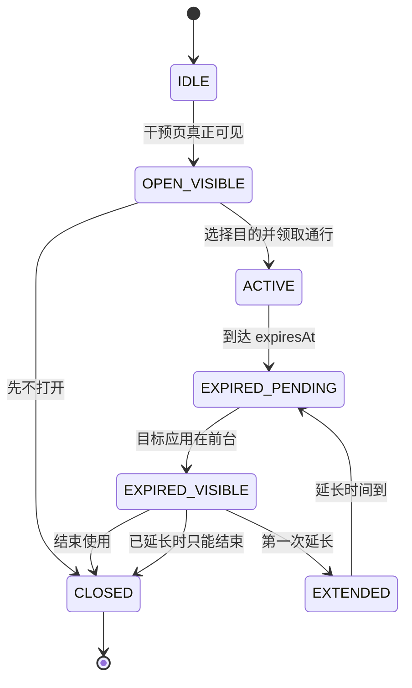

# 停一下（PauseNow）Sprint 1 产品规则与数据模型冻结

> 文档版本：v1.0  
> 冻结日期：2026-07-18  
> 适用版本：Android v0.2.0 封闭 Alpha  
> 状态：Sprint 1 开发基线  
> 变更原则：本文件的 P0 规则未经负责人评审不得自行修改

---

## 1. 冻结结论

v0.2.0 采用以下最小产品模型：

- 一个目标应用只能存在一条有效规则；
- 一条规则在二期只绑定一个目标应用；
- 用户每次打开目标应用，必须先明确本次目的，才能领取通行；
- 单次通行最多延长一次；
- 报告只统计真正展示给用户且完成选择的干预，不统计启动请求和重复抑制；
- 不把“计划通行时长”描述成“真实使用时长”；
- 所有数据保存在本机，不新增网络、账号和服务端；
- 运行时快照继续采用本地原子存储，数据 schema 从 v2 升级为 v3。

这组规则优先解决当前验证版本已经出现的三个问题：同一个抖音包名存在两条启用规则、同一会话可连续延长多次、报告中的弹出次数不能代表用户真实看到的干预。

---

## 2. 二期产品边界

### 2.1 本期支持

- Android 8.0 及以上；
- 从 LAUNCHER 应用列表选择一个目标应用；
- 为目标应用设置单次通行时长；
- 设置是否允许一次延长及延长时长；
- 启用、停用、编辑、删除规则；
- 打开前选择使用目的；
- 到期后结束或延长一次；
- 今日行为反馈和近 7 日趋势；
- 本地诊断、数据清除、权限修复和厂商引导。

### 2.2 本期不支持

- 一条规则绑定多个应用；
- 同一应用存在多条规则；
- 自定义数字时长；
- 每日限额、复杂时间段和工作日规则；
- 无限延长或用户自定义延长次数；
- 自定义自由文本目的；
- 云同步、账号、订阅和远程控制。

---

## 3. 核心产品规则

### R-001：目标应用唯一性

`packageName` 是规则唯一业务键。同一包名最多存在一条未归档规则，不允许通过新建、编辑、迁移或并发保存产生重复规则。

保存策略：

```text
不存在相同 packageName -> 创建
存在相同 packageName 且 ruleId 相同 -> 更新
存在相同 packageName 且 ruleId 不同 -> 拒绝并跳转编辑已有规则
```

用户文案：

> 抖音已经在保护中，可以直接修改现有规则。

### R-002：规则绑定范围

二期每条规则只绑定一个应用。代码层可以保留旧版 `targetPackages` 迁移入口，但 v3 的领域对象使用单值 `targetPackageName`。

### R-003：固定时长选项

单次通行时长只能选择：

- 3 分钟；
- 5 分钟，默认；
- 10 分钟；
- 15 分钟。

延长规则只能选择：

- 不允许延长；
- 延长 3 分钟，默认；
- 延长 5 分钟。

UI 不提供任意数字输入，领域层仍需校验白名单，不能只依赖界面限制。

### R-004：使用目的

新通行必须包含以下一个目的：

| 枚举 | 用户文案 |
|---|---|
| `FIND_SPECIFIC_CONTENT` | 找一个明确内容 |
| `HANDLE_ONE_TASK` | 处理一件事 |
| `RELAX_BRIEFLY` | 放松一下 |
| `NO_CLEAR_PURPOSE` | 没有明确目的 |
| `UNSPECIFIED_LEGACY` | 旧版本未记录，仅用于迁移 |

规则：

- 用户没有选择目的时不能创建通行；
- `UNSPECIFIED_LEGACY` 不得由新版 UI 创建；
- 不存储自由文本，避免隐私和统计不可控；
- 选择“没有明确目的”后增加 2 秒静默确认，但用户仍可正常继续。

### R-005：打开前选择

打开前干预只有两类完成结果：

- `GRANT_PASS`：选择目的后开始计时；
- `EXIT_BEFORE_OPEN`：点击“先不打开”或按系统返回键。

Activity 启动请求、被盖恢复、冷却抑制不属于用户结果。

### R-006：只允许延长一次

同一 `sessionId` 的 `extensionCount` 只能为 0 或 1。

必须在三层同时限制：

1. Domain：`extend()` 在 `extensionCount >= 1` 时返回错误；
2. Store：反序列化和写入时拒绝大于 1 的新数据；
3. UI：延长过后隐藏延长按钮，展示“本次延长已使用”。

不得只隐藏按钮。自动化测试必须证明进程重启、重复点击和并发调用都无法绕过。

### R-007：到期处理

通行到期后进入 `EXPIRED_PENDING`：

- 目标应用仍在前台或再次进入前台：展示到期干预；
- 目标应用已离开：发送到期通知，保留待处理状态；
- 用户 24 小时内未再次打开：清理为 `EXPIRED_UNUSED`，不计入“到期干预展示”。

### R-008：规则修改对现有通行的影响

通行创建时复制规则中的时长参数。通行开始后修改规则，不改变正在进行的通行，避免计时突然变化。

### R-009：停用和删除规则

- 停用规则：立即取消该应用的有效通行和到期闹钟；保留报告历史；
- 删除规则：二次确认后取消通行、取消闹钟、删除规则；保留仅存于本机的历史事件及当时应用标识，供用户报告对账；
- 目标 App 已卸载：规则显示“应用不可用”，允许删除，不再参与检测。

### R-010：权限降级

- Usage Access 关闭：停止检测决策，不弹干预；
- AccessibilityService 关闭：服务结束，首页显示阻断性修复；
- 通知关闭：保护仍可运行，显示非阻断性警告；
- 厂商设置未确认：显示高优先级风险，但不得伪装成系统已检测失败。

### R-011：数据清除语义

设置页拆成两个明确操作：

1. **清除规则与使用记录**：规则、通行、事件、技术追踪、闹钟全部清除；保留系统权限和 Onboarding 完成状态。
2. **重新运行新手引导**：仅重置 Onboarding 路由和厂商人工确认，不自动撤销系统权限。

界面不得再用含糊的“清除全部数据”描述第一种操作。

---

## 4. 状态机冻结



状态约束：

- `OPEN_VISIBLE` 必须由 `InterventionActivity.onResume` 产生；
- `launchRequested` 不得直接进入 `OPEN_VISIBLE`；
- `EXTENDED` 只能进入一次；
- 任何结束路径都要取消对应闹钟并释放 `inFlight`；
- 启动失败必须即时释放 `inFlight`，不等待 5 分钟自愈。

---

## 5. 数据模型 v3

### 5.1 ProtectionRule

```kotlin
data class ProtectionRule(
    val id: String,
    val targetPackageName: String,
    val cachedAppLabel: String,
    val passDurationSeconds: Int,
    val extensionDurationSeconds: Int,
    val enabled: Boolean,
    val createdAtMs: Long,
    val updatedAtMs: Long,
    val schemaVersion: Int = 3,
)
```

不变量：

```text
targetPackageName 非空
passDurationSeconds in {180, 300, 600, 900}
extensionDurationSeconds in {0, 180, 300}
同一 targetPackageName 唯一
cachedAppLabel 只用于展示，匹配始终使用 packageName
```

规则名从二期普通 UI 移除。用户看到应用名即可；旧 `name` 只用于迁移和诊断，不再作为核心字段。

### 5.2 ActivePass

```kotlin
data class ActivePass(
    val sessionId: String,
    val ruleId: String,
    val packageName: String,
    val purpose: PassPurpose,
    val plannedDurationSeconds: Int,
    val extensionDurationSeconds: Int,
    val grantedAtMs: Long,
    val expiresAtMs: Long,
    val extensionCount: Int,
    val status: PassStatus,
)
```

`PassStatus`：

```kotlin
enum class PassStatus {
    ACTIVE,
    EXPIRED_PENDING,
    ENDED,
    EXPIRED_UNUSED,
    CANCELLED_RULE_DISABLED,
    CANCELLED_RULE_DELETED,
    CANCELLED_TIME_CHANGED,
}
```

### 5.3 InterventionTrace

用于计算可靠性和延迟，不作为用户行为结果：

```kotlin
data class InterventionTrace(
    val traceId: String,
    val ruleId: String?,
    val sessionId: String?,
    val packageName: String,
    val mode: InterventionMode,
    val detectedAtMs: Long,
    val decisionAtMs: Long?,
    val launchRequestedAtMs: Long?,
    val visibleAtMs: Long?,
    val actionAtMs: Long?,
    val launchResult: LaunchResult?,
    val actionResult: ActionResult?,
)
```

延迟口径：

```text
detectionToVisibleMs = visibleAtMs - detectedAtMs
launchToVisibleMs = visibleAtMs - launchRequestedAtMs
```

只有 `visibleAtMs != null` 才能记作用户看到了干预。

### 5.4 InterventionEvent

面向报告的产品事件：

```kotlin
enum class ProductEventType {
    OPEN_INTERVENTION_VISIBLE,
    EXIT_BEFORE_OPEN,
    PASS_GRANTED,
    EXPIRED_INTERVENTION_VISIBLE,
    PASS_EXTENDED,
    END_AT_EXPIRY,
    PASS_EXPIRED_UNUSED,
}
```

```kotlin
data class InterventionEvent(
    val eventId: String,
    val traceId: String?,
    val sessionId: String?,
    val ruleId: String?,
    val packageName: String,
    val cachedAppLabel: String,
    val type: ProductEventType,
    val occurredAtMs: Long,
    val purpose: PassPurpose?,
    val durationSeconds: Int?,
)
```

技术事件如 `SUPPRESSED`、`RECOVERED`、`LAUNCH_FAILED` 只进入 Trace，不进入用户报告。

### 5.5 PermissionSnapshot

```kotlin
data class PermissionSnapshot(
    val usageAccessGranted: Boolean,
    val accessibilityServiceRunning: Boolean,
    val notificationsGranted: Boolean,
    val vendorSteps: List<VendorStep>,
    val checkedAtMs: Long,
)

data class VendorStep(
    val type: VendorStepType,
    val state: ManualConfirmationState,
)

enum class ManualConfirmationState {
    NOT_REQUIRED,
    NOT_CONFIRMED,
    CONFIRMED_BY_USER,
}
```

厂商步骤不得使用 `GRANTED/DENIED` 命名，因为系统通常无法可靠读取该状态。

### 5.6 ProtectionHealth

```kotlin
data class ProtectionHealth(
    val blockingIssues: List<ProtectionIssue>,
    val warnings: List<ProtectionIssue>,
    val enabledRuleCount: Int,
    val activePasses: List<ActivePass>,
)
```

优先级：

1. Usage Access 关闭；
2. AccessibilityService 未运行；
3. 没有启用规则；
4. 厂商步骤未确认；
5. 通知关闭；
6. 正常保护或通行中。

---

## 6. 报告指标冻结

### 6.1 用户可见指标

| 指标 | 定义 |
|---|---|
| 干预次数 | `OPEN_INTERVENTION_VISIBLE + EXPIRED_INTERVENTION_VISIBLE` |
| 主动停下次数 | `EXIT_BEFORE_OPEN + END_AT_EXPIRY` |
| 通行次数 | `PASS_GRANTED` |
| 计划通行时长 | `PASS_GRANTED.duration + PASS_EXTENDED.duration` 之和 |
| 延长次数 | `PASS_EXTENDED` |
| 主动停下率 | 主动停下次数 / 有用户结果的可见干预次数 |

“有用户结果的可见干预次数”只包含用户最终选择了离开、通行、延长或结束的可见页面。页面被系统销毁且没有动作时只用于诊断。

样本小于 3 次时不显示百分比评价，只显示事实计数。

### 6.2 不允许出现的指标名

- “今日使用时长”；
- “节省了 X 分钟”；
- “成功戒掉 X 次”；
- 直接展示 `open/expired/grant/extend/end` 工程事件名；
- 把包名作为普通用户分组标题。

### 6.3 技术指标

- 每台设备打开次数；
- 5 秒内干预成功率；
- P50/P95 `detectionToVisibleMs`；
- 启动失败率；
- 恢复启动率；
- 抑制率；
- 权限降级次数；
- 服务异常销毁次数。

技术指标只在诊断页面显示。

---

## 7. 存储与保留策略

| 数据 | 存储 | 保留 |
|---|---|---|
| ProtectionRule | Snapshot Store | 删除或清除前持续保留 |
| ActivePass | SharedPreferences | 会话结束后移除，结果进入事件 |
| InterventionEvent | 本地事件存储 | 最近 30 天，最多 2000 条 |
| InterventionTrace | 本地环形存储 | 最近 300 条 |
| Onboarding | Preferences | 用户重置前保留 |
| VendorStep | Preferences | 用户重新引导或清除确认前保留 |

达到条数上限时按 `occurredAtMs` 删除最旧记录。删除不得阻塞检测线程。

---

## 8. v2 → v3 迁移

### 8.1 规则迁移

旧规则按 `targetPackages` 展开。相同包名存在多条规则时选择一个主规则：

1. 启用规则优先；
2. `priority` 高者优先；
3. 更新时间晚者优先；
4. 仍相同时按 `id` 字典序取第一条。

其余重复规则归档到迁移日志，不进入 v3 活跃规则列表。首次进入规则页显示一次提示：

> 已合并同一应用的重复规则，请确认新的保护时长。

### 8.2 通行迁移

- 没有 purpose：写入 `UNSPECIFIED_LEGACY`；
- `extensionCount > 1`：迁移为 1，禁止再次延长；
- 已过期：写入 `EXPIRED_PENDING`；
- 找不到对应规则：取消通行并取消闹钟。

### 8.3 事件迁移

旧事件不反推“用户真正看到页面”。它们保留在诊断中，但不进入新版主动停下率。v0.2.0 报告首次启动时显示：

> 新版报告从升级后开始按更准确的口径统计。

---

## 9. Repository 接口冻结

```kotlin
interface RuleRepository {
    fun observeRules(): Flow<List<ProtectionRule>>
    suspend fun getRule(id: String): ProtectionRule?
    suspend fun getRuleByPackage(packageName: String): ProtectionRule?
    suspend fun save(rule: ProtectionRule): SaveRuleResult
    suspend fun setEnabled(id: String, enabled: Boolean)
    suspend fun delete(id: String)
}

interface ActivePassRepository {
    fun get(packageName: String): ActivePass?
    fun grant(command: GrantPassCommand): ActivePass
    fun extendOnce(sessionId: String): ExtendResult
    fun end(sessionId: String, reason: PassEndReason)
    fun cancelForRule(ruleId: String, reason: PassEndReason)
}

interface EventRepository {
    fun append(event: InterventionEvent)
    fun query(fromMs: Long, toMs: Long): List<InterventionEvent>
    fun clear()
}

interface TraceRepository {
    fun appendOrUpdate(trace: InterventionTrace)
    fun latest(limit: Int): List<InterventionTrace>
    fun clear()
}
```

`SaveRuleResult` 必须区分 `Created`、`Updated`、`DuplicatePackage(existingRuleId)` 和 `ValidationFailed`。

---

## 10. 必须完成的自动化测试

### 10.1 Rule

- 相同包名不能新建第二条规则；
- 编辑同一 ruleId 可以保存；
- 非白名单时长保存失败；
- 规则停用/删除取消有效通行和闹钟；
- v2 重复规则迁移结果确定且可重复。

### 10.2 Pass

- 未选择目的不能 grant；
- 第一次 extend 成功；
- 第二次 extend 返回 `AlreadyExtended`；
- 进程重启后仍不能第二次 extend；
- 并发两次 extend 只能一次成功；
- 规则修改不改变已开始会话；
- 时间回拨时异常会话被取消。

### 10.3 Event 与报告

- launch request 不计入干预次数；
- visible 但无动作不计入主动停下率分母；
- suppressed/recovered 不进入用户报告；
- 延长计入计划通行时长；
- 样本小于 3 不生成百分比；
- 跨零点按事件发生时间聚合。

### 10.4 清除数据

- 规则、通行、事件、Trace、闹钟全部清理；
- 系统权限保持不变；
- Onboarding 保留；
- 重新运行新手引导只重置引导和厂商人工确认。

---

## 11. Sprint 1 代码任务顺序

1. 创建 v3 模型与枚举；
2. 实现 v2 → v3 迁移和测试；
3. 实现包名唯一性约束；
4. 实现 PassPurpose 和 grant 校验；
5. 实现 `extendOnce` 三层约束；
6. 实现 InterventionTrace；
7. 重写报告聚合器；
8. 实现统一 ProtectionHealth；
9. UI 只消费以上稳定模型，不直接读取 SharedPreferences JSON。

---

## 12. 冻结验收清单

- [x] 一应用一规则；
- [x] 一规则一应用；
- [x] 固定通行和延长时长；
- [x] 四类用户目的；
- [x] 最多延长一次；
- [x] 可见干预和启动请求分离；
- [x] 用户指标和技术指标分离；
- [x] 权限状态和厂商人工确认分离；
- [x] v2 → v3 迁移规则；
- [x] 数据清除语义；
- [x] Repository 接口和自动化测试边界。

以上项目构成 v0.2.0 产品与数据基线。新增复杂规则、无限延长、自由文本和服务端数据均需另开变更评审。

---

## 13. 变更记录

| 版本 | 日期 | 变更 |
|---|---|---|
| v1.0 | 2026-07-18 | 冻结 v0.2.0 产品规则、状态机、schema v3、报告口径和迁移策略 |
