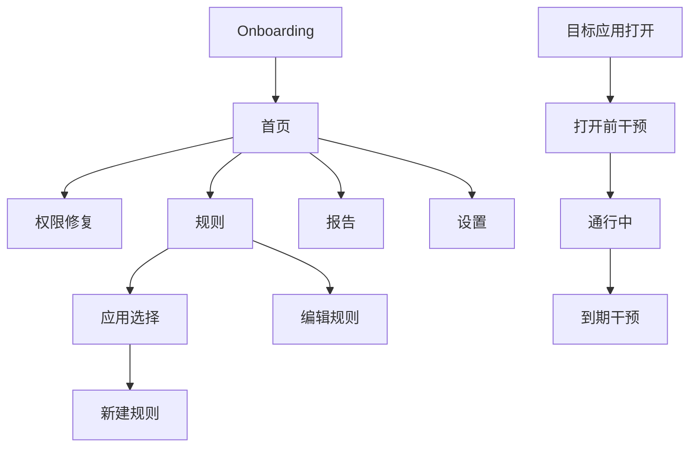

# 停一下（PauseNow）Sprint 1 UI 审查与重构规格

> 文档版本：v1.0  
> 编制日期：2026-07-18  
> 审查范围：首页、规则、应用选择、报告、设置  
> 证据：用户提供的 7 张华为真机验证截图  
> 选定视觉方向：方案 3（行动仪表）  
> 目标：从技术验证界面重构为可供普通用户封闭测试的 Android UI

---

## 1. 总体判断

当前界面已经能够支撑开发者完成技术验证，优点是流程完整、按钮尺寸充足、绿色主色稳定、应用选择器已经具备真实图标和搜索。

但它还不能直接进入真实用户封测，原因主要是：

- 首页同时表达“权限已就绪”和“华为设置未完成”，状态结论互相冲突；
- 同一个抖音包名出现两条启用规则，用户无法理解实际生效哪一条；
- 创建和编辑规则暴露包名、规则名和任意数字输入；
- 报告显示工程事件而不是用户成果；
- 设置页把破坏性操作设计成最显眼的主按钮；
- 页面间缺少稳定导航、返回结构和统一状态组件；
- 截图中较大字体下，表单密度和标签布局已经接近溢出风险。

Sprint 1 的 UI 目标不是增加装饰，而是让每个页面只回答一个清晰问题。

---

## 2. 审查流程与健康度

| 步骤 | 截图 | 用户任务 | 健康度 |
|---:|---|---|---|
| 1 | `6.jpg` | 判断保护是否正常 | 较差：状态冲突、信息过载 |
| 2 | `5.jpg` | 查看和管理规则 | 较差：重复规则、包名暴露 |
| 3 | `3.jpg` | 创建规则 | 较差：技术字段过多、输入风险高 |
| 4 | `7.jpg` | 选择目标应用 | 一般：基础可用，缺少筛选与已保护状态 |
| 5 | `4.jpg` | 编辑或删除规则 | 较差：重复技术输入、危险操作弱约束 |
| 6 | `2.jpg` | 理解今日结果 | 较差：工程事件不可解释、数字缺乏意义 |
| 7 | `微信图片_20260718221226_630_16.jpg` | 设置和诊断 | 一般偏差：功能太少，清除数据过于突出 |

---

## 3. 已有优势

- 颜色体系已有雏形：深绿色可继续作为品牌主色；
- 主要按钮尺寸大，适合移动端触控；
- 应用选择列表已经使用真实应用图标和名称；
- 规则、报告和设置均已形成独立路由；
- 华为特殊设置风险已经在产品内披露；
- 页面留白充足，没有堆叠广告或无关功能。

重构应保留这些基础，不需要推翻重做品牌。

---

## 4. 逐屏问题与决定

### 4.1 首页

当前证据：`6.jpg`。

问题：

1. “权限已就绪”绿色卡和“华为机型未开后台保活与弹出”红色卡同时出现，用户不知道产品到底能不能工作；
2. 厂商说明占据首屏大部分空间，保护状态反而在下方；
3. 展示包名，不展示抖音图标和名称；
4. “规则 2 条（启用 2 条）”没有指出同一应用重复规则冲突；
5. 唯一主操作是“保护规则”，缺少“去修复”与正在通行操作；
6. 两个华为/USB 小图标属于系统截图区域，不纳入 App 视觉设计。

重构决定：

- 首屏只显示一个总状态：`保护中`、`需要修复` 或 `暂无规则`；
- 有阻断问题时只显示一个主按钮“去修复”；
- 厂商长说明移入权限修复中心，首页只保留一句风险摘要；
- 规则摘要展示应用图标和名称，不展示包名；
- 正在通行时展示倒计时、目的和“立即结束”；
- 底部提供首页、规则、报告三主导航，设置从右上角进入。

### 4.2 规则列表

当前证据：`5.jpg`。

问题：

1. 同一包名存在两条启用规则，是当前最高优先级产品缺陷；
2. 两张卡都叫 `aweme`，普通用户不知道这是抖音；
3. 包名占据主要信息层级；
4. “已启用”只是文本，无法直接切换；
5. 加号悬浮按钮缺乏文字，新用户不一定理解；
6. 规则卡片没有点击/编辑的明确提示。

重构决定：

- 一应用一规则，迁移时合并重复规则；
- 行首显示应用图标和名称；
- 主信息为“每次 5 分钟 · 可延长 3 分钟”；
- 行尾使用 Switch 启停；
- 整行可进入编辑，附右箭头；
- 空状态使用“添加第一个应用”文字按钮；
- 有规则时保留 FAB，但使用“+ 添加应用”的扩展形态或顶部文字按钮。

### 4.3 新建规则

当前证据：`3.jpg`。

问题：

1. 包名输入框看起来允许手动编辑，容易输错；
2. “从应用列表选择”与包名输入是两个竞争入口；
3. 规则名对普通用户没有必要；
4. 通行和延长时长使用任意数字文本框，存在 0、负数、极大值和键盘输入错误；
5. 启用复选框不符合“状态开关”心智；
6. 表单较长，在大字体和键盘弹出时可能遮挡保存按钮；
7. 缺少返回、校验、保存中和失败状态。

重构决定：

- 选择应用成为第一步，选中后显示应用图标和名称；
- 移除规则名；
- 用分段选项选择 3/5/10/15 分钟；
- 延长用“不允许/3 分钟/5 分钟”；
- 默认启用，不再提供创建时复选框；
- 底部固定主按钮“开始保护”；
- 内容区域可滚动，支持大字体和键盘避让；
- 保存前 Domain 再次校验重复包名和时长白名单。

### 4.4 应用选择器

当前证据：`7.jpg`。

问题：

1. 应用列表基础完整，但银行、税务、SIM 工具等与首要场景无关；
2. 包名作为高频副标题增加技术感；
3. 没有显示“已保护”；
4. 搜索框高度过大，压缩首屏列表；
5. 没有按短视频/内容类应用优先排序；
6. 仅凭截图无法确认 TalkBack 语义、点击区域和键盘搜索行为。

重构决定：

- 搜索框采用标准 56dp 高度；
- 默认优先展示已识别的内容类应用，其余放在“所有应用”；
- 普通模式隐藏包名，诊断模式可查看；
- 已有规则的应用显示“已保护”并点击后跳转编辑；
- 每行触控区域不小于 56dp；
- 搜索结果为空时显示清晰空状态。

### 4.5 编辑规则

当前证据：`4.jpg`。

问题：

- 重复暴露包名和应用选择按钮；
- 用户可能在编辑中把目标应用换成已有规则的应用；
- 仍使用任意数字输入；
- 保存按钮和删除按钮缺乏明确分区；
- 删除只是一行红字，从截图无法证明有二次确认；
- 未显示当前是否存在通行，修改规则的影响不明确。

重构决定：

- 顶部为应用身份卡，不允许在编辑页直接换应用；
- 若要换应用，删除规则后重新添加；
- 使用与新建相同的时长组件；
- 启停 Switch 放在应用身份卡；
- 删除移动到页面底部“危险操作”区域并弹确认 Sheet；
- 若存在有效通行，停用/删除时说明会立即结束本次通行。

### 4.6 报告

当前证据：`2.jpg`。

问题：

1. `打开前干预弹出/到期干预弹出/放行/延长/结束` 是工程事件，不是用户能理解的反馈；
2. 打开前 4 次但到期 18 次、延长 9 次，数字暴露重复延长和统计口径问题；
3. “按应用”使用包名；
4. 没有日期范围、趋势、解释或下一步建议；
5. 所有数字放在同一卡片中，缺乏重点；
6. 大量空白说明信息架构尚未完成。

重构决定：

- 主指标改为“主动停下次数”；
- 辅助显示干预次数、通行次数、计划通行时长；
- 添加近 7 日简单柱状趋势；
- 应用分组显示图标和应用名；
- 样本小于 3 时不显示百分比；
- 工程事件移入诊断页，不进入报告。

### 4.7 设置

当前证据：`微信图片_20260718221226_630_16.jpg`。

问题：

- “清除全部数据”使用品牌主按钮，视觉上像推荐操作；
- 文案说不影响引导状态，名称却暗示清除全部；
- 诊断信息只有设备、系统和版本，无法支持封测定位；
- 缺少权限修复、厂商设置、隐私政策、用户协议和重新引导；
- 页面下半部分大量空白。

重构决定：

- 设置改为标准分组列表，不把每组都做成大卡片；
- 第一组为权限与厂商设置；
- 第二组为隐私和协议；
- 第三组为诊断、复制诊断和版本；
- “清除规则与使用记录”放在危险操作区并二次确认；
- “重新运行新手引导”独立操作；
- 诊断增加权限快照、厂商确认、最近 Trace 和 P50/P95。

---

## 5. 信息架构冻结

底部导航：

- 首页；
- 规则；
- 报告。

设置从首页右上角进入。Onboarding、权限修复、规则编辑、应用选择和两类干预页不显示底部导航。

---

## 6. 设计系统冻结

### 6.0 方案 3 视觉基线

方案 3 是 v0.2.0 唯一实现基线，另外两套探索稿不再进入开发混用。

首页结构映射：

1. 深绿色 Top App Bar：品牌名与设置入口；
2. 浅绿色 Protection Hero：`保护正常 / 需要修复 / 暂无规则`；
3. 深绿色 Active Pass：应用、倒计时、目的、进度和结束操作；
4. 白色 Today Overview：主动停下、通行、计划时长；
5. 白色 Rules Surface：最多两条规则预览、Switch 和管理入口；
6. 白色 Bottom Navigation：首页、规则、报告。

视觉约束：

- 页面只允许一个深绿色高权重内容卡，优先分配给正在进行的通行；
- 没有通行时，Protection Hero 成为首屏最高权重区域；
- “权限已就绪”只能作为正常状态的辅助标签，出现阻断问题时必须替换为“需要修复”；
- 今日指标使用同一主色系，不照搬探索图中的蓝色通行数字和橙色计划数字；
- 规则 Switch 只负责启停，点击行进入编辑，两个操作语义必须分离；
- 图标统一采用 Android Material Symbols Rounded 风格；
- 方案图中的抖音、快手图标仅表示真实应用图标位置，实际从 PackageManager 读取。

### 6.1 色彩

| Token | Light | 用途 |
|---|---|---|
| `Primary` | `#356C63` | 主操作、品牌 |
| `OnPrimary` | `#FFFFFF` | 主按钮文字 |
| `PrimaryContainer` | `#D9E8E3` | 成功/保护状态背景 |
| `Background` | `#F6F7F4` | 页面背景 |
| `Surface` | `#FFFFFF` | 列表和 Sheet |
| `SurfaceVariant` | `#EDF0EC` | 次级分区 |
| `TextPrimary` | `#1E2623` | 标题、正文 |
| `TextSecondary` | `#66706C` | 辅助文字 |
| `Warning` | `#A96D22` | 非阻断性风险 |
| `WarningContainer` | `#FFF0D8` | 厂商/通知提示 |
| `Error` | `#B5544B` | 阻断错误、危险操作 |
| `ErrorContainer` | `#FBE5E2` | 错误背景 |
| `Outline` | `#C5CCC8` | 分割线、输入边框 |

不再使用高饱和薄荷绿作为大面积状态背景；它与深绿色主色不一致，也容易被误解为装饰色。

### 6.2 字体

| 样式 | 建议 |
|---|---|
| Display | 32sp / Medium，仅干预页关键标题 |
| Headline | 26sp / Semibold，页面标题 |
| Title | 18sp / Semibold，卡片和分组标题 |
| Body | 16sp / Regular，主要内容 |
| Label | 14sp / Medium，辅助和按钮 |

支持系统字体缩放到 200%。不得通过固定高度截断正文；长页面必须可滚动。

### 6.3 间距与形状

- 页面水平边距：20dp；
- 标题到正文：24dp；
- 区块间距：24dp；
- 行内间距：12dp；
- 卡片圆角：20dp；
- 按钮圆角：16dp；
- Bottom Sheet 顶部圆角：28dp；
- 主按钮高度：52dp；
- 标准列表行最小高度：64dp；
- 所有触控目标至少 48 × 48dp。

### 6.4 组件

- `PauseTopAppBar`
- `PauseBottomNavigation`
- `ProtectionHero`
- `ProtectionIssueRow`
- `ActivePassCard`
- `RuleRow`
- `AppRow`
- `DurationSegment`
- `PurposeChoice`
- `MetricTile`
- `TrendChart`
- `VendorGuideSheet`
- `DangerActionRow`
- `PausePrimaryButton`
- `PauseSecondaryButton`
- `PauseEmptyState`
- `PauseInlineError`

组件状态至少覆盖：normal、pressed、disabled、loading、error、large-font。

---

## 7. 页面结构规格

### 7.1 首页结构

1. Top App Bar：停一下、设置；
2. Protection Hero：唯一总状态 + 唯一主操作；
3. Active Pass：仅在通行中出现；
4. 今日反馈：主动停下、通行、计划时长；
5. 启用规则：最多 3 条；
6. Bottom Navigation。

状态文案：

| 状态 | 标题 | 说明 | 操作 |
|---|---|---|---|
| Ready | 保护中 | 正在守护 2 个应用 | 查看规则 |
| Active Pass | 通行中 · 04:32 | 正在使用抖音 · 找一个明确内容 | 立即结束 |
| Needs Repair | 保护已暂停 | 使用情况访问需要重新开启 | 去修复 |
| Vendor Risk | 还差一步 | 请确认华为后台运行设置 | 查看步骤 |
| Empty | 先选择一个容易刷久的应用 | 建立第一条保护规则 | 添加应用 |

### 7.2 规则编辑结构

1. 应用身份；
2. 每次可以使用多久；
3. 到时是否允许延长；
4. 新建页主操作“开始保护”或编辑页“保存修改”；
5. 编辑页危险操作区。

无需规则名、包名文本框和“启用”复选框。

### 7.3 报告结构

1. 今天 / 近 7 天切换；
2. 主动停下主指标；
3. 三个事实指标；
4. 7 日趋势；
5. 按应用分组；
6. 指标说明入口。

### 7.4 设置结构

1. 保护权限；
2. 手机厂商设置；
3. 隐私与协议；
4. 诊断与反馈；
5. 版本信息；
6. 数据与重置。

---

## 8. Compose 实现约束

- 使用 Material 3，但颜色、圆角和字体通过 `PauseNowTheme` 统一覆盖；
- 页面状态只从 ViewModel 的不可变 `UiState` 获取；
- Composable 不直接读 SharedPreferences；
- 保存和删除操作使用单向事件；
- 所有列表使用稳定 key；
- 规则表单内容可滚动，主操作使用安全区内固定底栏；
- `collectAsStateWithLifecycle` 收集状态；
- `ON_RESUME` 刷新系统权限，但不得重复刷新普通数据；
- 图标使用 Material Symbols 或现有 Android 矢量资源，不用 emoji；
- 包名仅在诊断模式出现；
- 所有核心组件提供 Light、Dark、200% font scale Preview；
- 动画时长 150～250ms，遵循系统减少动画设置；
- TalkBack 文案不得只读“按钮”或图标名，要描述动作与状态。

---

## 9. 可访问性风险与验证

从截图可以确认或推断的风险：

- 表单 Label 和输入框在较大字体下空间紧张；
- Checkbox 的语义和触控区域无法从截图确认；
- 红色删除文字可能只依赖颜色表达危险；
- 当前卡片背景与次级文字的实际对比度需通过代码色值计算；
- 应用行是否整行可点、TalkBack 顺序和焦点恢复无法从截图确认；
- 键盘弹出后的保存按钮可见性无法从静态截图确认；
- 返回系统设置后的焦点和状态播报需要真机测试。

Sprint 1 验证：

- 字体缩放 100%、130%、160%、200%；
- TalkBack 完成 Onboarding、建规则和删除规则；
- Android 12、14、16；
- 最小 360dp 宽度；
- 高对比度文字检查；
- 触控目标不小于 48dp；
- 错误必须同时有文字、图标或结构，不只依赖颜色。

本审查基于静态截图，不能声称已经达到完整无障碍合规。

---

## 10. UI 开发任务

| ID | 任务 | 依赖 | 验收 |
|---|---|---|---|
| UI-S1-01 | PauseNowTheme 与 Token | 无 | Light/Preview 完成，无页面硬编码颜色 |
| UI-S1-02 | Top Bar 与底部导航 | UI-S1-01 | 三主入口稳定，返回逻辑正确 |
| UI-S1-03 | ProtectionHero | ProtectionHealth | 五种状态截图验收 |
| UI-S1-04 | RuleRow 与规则列表 | 唯一规则模型 | 不显示包名，不出现重复应用 |
| UI-S1-05 | AppRow 与应用选择器 | AppRepository | 搜索、已保护、空状态 |
| UI-S1-06 | DurationSegment | v3 时长白名单 | 3/5/10/15 与延长选项一致 |
| UI-S1-07 | 规则新建/编辑 | UI-S1-04～06 | 无任意数字输入，重复应用可恢复 |
| UI-S1-08 | ReportScreen | 新报告聚合 | 用户指标与事件可对账 |
| UI-S1-09 | SettingsScreen | Trace/Permission | 权限、诊断、隐私和危险操作分组 |
| UI-S1-10 | 大字体与 TalkBack 修复 | 所有组件 | 核心流程在 200% 字体下可完成 |

---

## 11. Sprint 1 完成门槛

- [x] 现有 7 个页面完成 UX/UI 审查；
- [x] 信息架构冻结；
- [x] 色彩、字体、间距和组件清单冻结；
- [x] 首页、规则、应用选择、报告、设置重构规格完成；
- [x] 包名和工程事件退出普通用户界面；
- [x] 大字体、TalkBack 和危险操作要求写入验收；
- [x] 三套首页视觉方向已选定方案 3；
- [ ] 选定方向后制作全部核心页面高保真稿；
- [ ] 获得 Android 源码后开始 Compose 实现。

---

## 12. 变更记录

| 版本 | 日期 | 变更 |
|---|---|---|
| v1.0 | 2026-07-18 | 基于华为真机验证截图完成 UI 审查、信息架构和重构规格冻结 |
