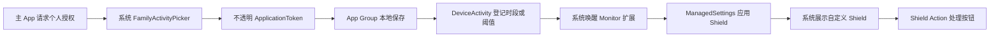
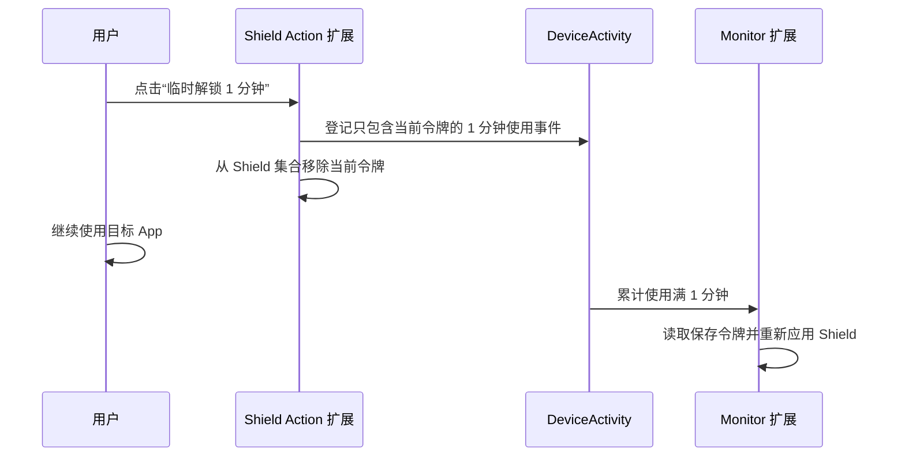

# PauseNow 技术方案

## 1. 技术边界

本阶段只使用 Apple 公开框架：

- `FamilyControls`：请求个人设备授权，展示系统应用选择器；
- `DeviceActivity`：登记时段与使用阈值，由系统唤醒扩展；
- `ManagedSettings`：对选中的应用令牌应用或解除 Shield；
- `ManagedSettingsUI`：定制系统 Shield 的文字、图标和按钮。

系统向工程提供的是不透明应用令牌。工程无法读取 Bundle ID 或应用名称，因此“选择抖音”必须由用户在系统选择器里人工完成，也不能单独识别微信里的视频号。

## 2. 工程结构

```text
PauseNow
├── PauseNow                         主 App：技术验证面板
├── PauseNowDeviceActivityMonitor    时段与阈值回调扩展
├── PauseNowShieldConfiguration      自定义 Shield 外观扩展
├── PauseNowShieldAction             Shield 按钮动作扩展
├── PauseNow/Shared                  主 App 与扩展共享的常量、令牌和日志逻辑
├── Configuration                    Info.plist 与 entitlement
└── project.yml                      XcodeGen 工程定义
```

Bundle ID 与能力：

| Target | Bundle ID | Family Controls | App Group |
|---|---|---:|---:|
| 主 App | `com.pausenow.app` | 是 | `group.com.pausenow.shared` |
| Device Activity Monitor | `com.pausenow.app.device-activity-monitor` | 是 | 同上 |
| Shield Configuration | `com.pausenow.app.shield-configuration` | 是 | 不需要共享数据 |
| Shield Action | `com.pausenow.app.shield-action` | 是 | 同上 |

正式签名前，可以把 `com.pausenow` 前缀替换为公司拥有的反向域名，但必须同步修改 `project.yml`、4 份 entitlement、开发者后台 App ID 和 App Group。

## 3. 核心数据流



不使用账号、服务器、广告 SDK 或分析 SDK。选择令牌与技术日志只写入本机 App Group。

## 4. 六项实现

### 4.1 授权

主 App 调用：

```swift
try await AuthorizationCenter.shared.requestAuthorization(for: .individual)
```

这是成人自我管理场景需要的个人设备授权。用户仍可在系统设置中撤销授权，产品不能也不应绕过。

### 4.2 选择抖音

主 App 展示 `FamilyActivityPicker`。用户人工只选择抖音，`FamilyActivitySelection` 通过 Property List 编码后保存到 `group.com.pausenow.shared`。扩展只能使用令牌，不能验证它在语义上是不是抖音。

### 4.3 指定时间屏蔽

主 App 创建一次性的 `DeviceActivitySchedule`。系统到 `intervalStart` 时唤醒 Monitor 扩展，扩展读取已保存令牌并应用 Shield；到 `intervalEnd` 时清理 Shield。

测试工程只接受同一天内的开始/结束时间。跨午夜、重复日历、节假日和规则重叠留到产品状态机阶段。

### 4.4 使用阈值屏蔽

主 App 登记全天重复的活动窗口，以及不包含历史用量的 1 分钟 `DeviceActivityEvent`。系统累计所选应用前台使用达到阈值后调用 `eventDidReachThreshold`，扩展应用 Shield。

当前阈值固定为 1 分钟，目的是缩短技术验证时间；不是产品默认值。

### 4.5 自定义 Shield

Shield Configuration 扩展提供：

- 标题：停一下；
- 说明：你为自己设置的使用时间已经到了；
- 主按钮：临时解锁 1 分钟；
- 次按钮：先不打开。

该界面属于系统托管 Shield，不是覆盖其他 App 的自建悬浮层。

### 4.6 临时解锁



这里的一分钟是“目标 App 的累计前台使用时间”，不是从点击开始计算的墙钟倒计时。这样无需让主 App 后台常驻。

## 5. 验证日志

主 App、Monitor 扩展和 Shield Action 扩展将最多 50 条技术事件写入 App Group。验证面板的“刷新回调记录”用于确认：

- 定时时段是否开始/结束；
- 使用阈值是否到达；
- Shield 按钮是否进入扩展；
- 临时解锁是否到期并重新屏蔽。

该日志只服务技术验证，不是生产分析方案。若系统没有启动扩展，App Group 中也不会出现对应记录。

## 6. 规则隔离

当前验证工程使用一个命名 `ManagedSettingsStore`。每次验证前先点击“停止监控并解除所有屏蔽”，再只启动一个用例。定时时段、日用量阈值和临时解锁同时运行时的优先级尚未产品化；不得用本工程推断复杂规则已经正确。

## 7. 平台风险

Apple 文档确认 `DeviceActivityCenter` 负责登记监控，并由系统在阈值到达时调用扩展；`ManagedSettingsUI` 用于自定义 Shield。与此同时，Apple Developer Forums 在 2026 年仍有 iOS 26.x 上阈值立即触发或 Monitor 扩展未被唤醒的报告。这里属于待真机复现和分版本验证的平台风险，不能仅靠静态代码消除。

参考：

- [Family Controls](https://developer.apple.com/documentation/familycontrols)
- [Configuring Family Controls](https://developer.apple.com/documentation/xcode/configuring-family-controls)
- [DeviceActivityCenter](https://developer.apple.com/documentation/deviceactivity/deviceactivitycenter)
- [Managed Settings UI](https://developer.apple.com/documentation/managedsettingsui)
- [ShieldActionDelegate](https://developer.apple.com/documentation/managedsettings/shieldactiondelegate)
- [iOS 26 DeviceActivityEvent regression discussion](https://developer.apple.com/forums/thread/808470)

